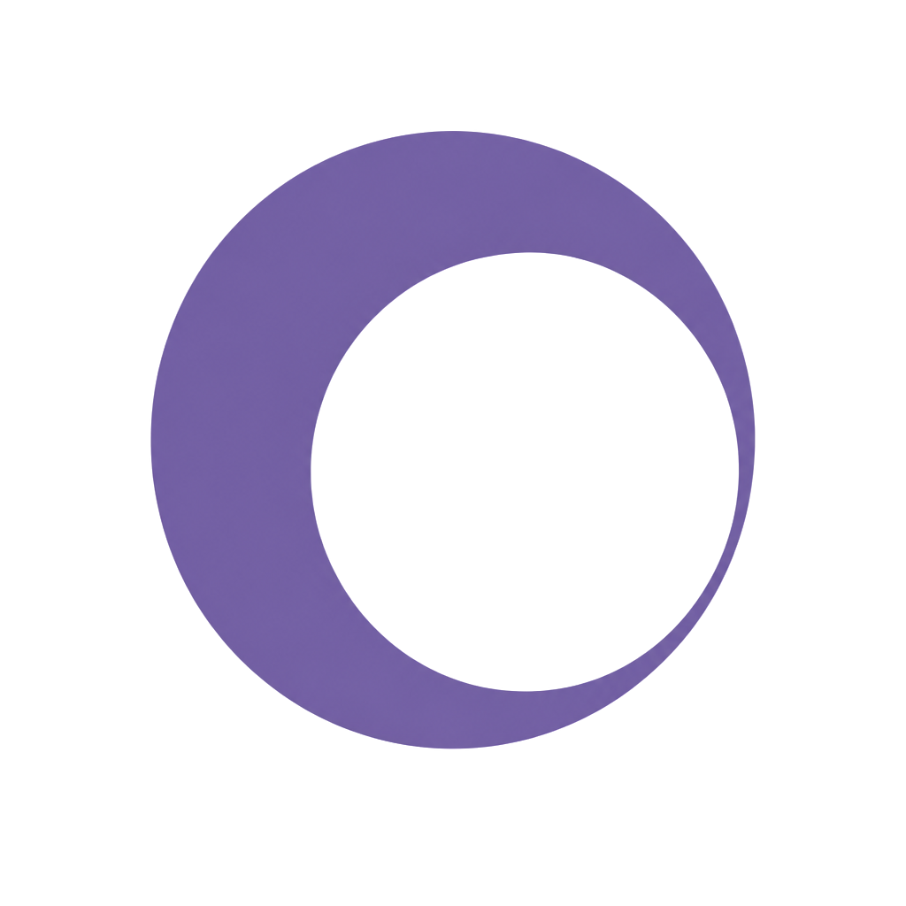

<p align="center">
  
</p>

<h1 align="center">Capto</h1>

<p align="center">
  <strong>Ultra-light Windows screen recorder</strong><br />
  Spiritual successor to <a href="https://github.com/MathewSachin/Captura">Captura</a>.
</p>

<p align="center">
  <a href="https://github.com/elwina/Capto/actions/workflows/ci.yml"></a>
  <a href="https://github.com/elwina/Capto/releases/latest"></a>
  <a href="LICENSE"></a>
  <a href="https://github.com/elwina/Capto/releases"></a>
  <a href="https://www.npmjs.com/package/capto-agent-skill"></a>
  <a href="https://www.npmjs.com/package/capto-dsh-plugin"></a>
  
  
</p>

<p align="center">
  <a href="README.zh-CN.md">中文</a> ·
  <a href="https://elwina.github.io/Capto/">Website</a> ·
  <a href="https://github.com/elwina/Capto/releases">Releases</a>
</p>

## Why Capto

| | |
|:---:|:---|
| 🪟 | **Capture modes + Windows-tuned stack** — Display / window / region, with a Windows-first path (DXGI / WASAPI and friends) instead of a generic lowest-common-denominator backend. |
| 🎬 | **MP4 & GIF** — Record to MP4 (auto NVENC / QSV / AMF / libx264) or export GIF. |
| ✨ | **Overlays** — Mouse-click highlights, keystroke overlay, webcam PiP, include-cursor, and live preview. |
| 🎞️ | **Rebuilt FFmpeg sidecar (`capto-ffmpeg`)** — Capto-owned, pinned, attested FFmpeg embedded in the app. Encoding goes only through this bundle — not whatever is on `PATH`. |
| 🤖 | **CLI + Agent integrations** — Full `capto` control plane (JSON, stable exit codes) plus [`capto-agent-skill`](https://www.npmjs.com/package/capto-agent-skill) (Agent Skills) and [`capto-dsh-plugin`](https://www.npmjs.com/package/capto-dsh-plugin) (DeepSeek Harness tools) so agents can doctor → record → stop → collect outputs. |
| 🔒 | **Open source · local · safe** — MIT, no upload SDKs, files stay on your machine. |

## Install

Download the NSIS setup for your CPU (**x64** / **arm64**) from [Releases](https://github.com/elwina/Capto/releases). Installers embed verified FFmpeg from [`capto-ffmpeg`](https://github.com/elwina/capto-ffmpeg) and the `capto` CLI at `<install>\cli\capto.exe`, and add that `cli` folder to your user **PATH** so `capto` works in new terminals (not a separate download).

### AI / agent support

Capto ships two agent integrations. Both talk to the same local `capto` CLI control plane, so install the desktop app first (above), then pick your agent:

**Agent Skill — [`capto-agent-skill`](https://www.npmjs.com/package/capto-agent-skill)**

Skill docs for any [Agent Skills](https://agentskills.io)-compatible agent (Claude Code, Cursor, …):

```bash
npm install capto-agent-skill
```

The skill is auto-discovered from `node_modules/capto-agent-skill/skills/capto/SKILL.md` (agentskills / skills-npm convention) and teaches the agent the doctor → record → stop → collect-outputs workflow.

**DeepSeek Harness plugin — [`capto-dsh-plugin`](https://www.npmjs.com/package/capto-dsh-plugin)**

First-class `capto_*` tools (status / record / shot / config / outputs …) for a dsh profile:

```bash
# npm-managed profile: install …
npm install --prefix ~/.dsh/profiles/web capto-dsh-plugin
```

…then enable it in the profile's `cordis.patch.yml`:

```yaml
- insert:
    - id: capto
      name: capto-dsh-plugin
      config:
        command: ['capto']            # or the absolute path to capto.exe
        timeoutMs: 120000
        noLaunch: false
        autoOpen: false
```

…or use the official pnpm/bundle flow, which wires everything automatically via `dsh.bundle`:

```bash
dsh plugin --profile web add capto-dsh-plugin
dsh --profile web --dump-config
```

Restart `dsh web` and the agent's toolset includes the `capto_*` tools. Config reference and tool list: [`packages/capto-dsh-plugin`](packages/capto-dsh-plugin).

## Develop
One command gets you from a fresh clone to a runnable `tauri dev`:

```powershell
.\scripts\setup-dev.ps1     # npm install + FFmpeg sidecar + CLI build/stage
```

Step-by-step (what setup-dev.ps1 does):

```bash
npm install --prefix apps/desktop
.\scripts\download-ffmpeg.ps1   # or copy-ffmpeg.ps1
cargo build -p capto-cli --release
.\scripts\copy-cli.ps1          # required for tauri build / package
npm run tauri --prefix apps/desktop -- dev
cargo test --workspace
cargo run -p capto-cli -- status
```

Environment variables (all optional; see `.env.example`):

```powershell
$env:CAPTO_APP_PATH = "D:\AIWorkspace\Capto\target\debug\capto-app.exe"  # CLI->desktop auto-launch
$env:RUST_LOG       = "debug"   # Rust tracing filter for CLI/app
```

If the CLI cannot find the desktop in dev, point `CAPTO_APP_PATH` at a
prebuilt `capto-app.exe` (see above).

Repo-hygiene checks (also enforced in CI):

```powershell
.\scripts\check-file-size.ps1   # fails on oversized source files
.\scripts\scan-tech-debt.ps1    # fails on TODO/FIXME/HACK/XXX in source
```
## Author

**Elwina Vardal** · [elwina.work](https://www.elwina.work) · [GitHub](https://github.com/elwina)

## License

MIT (clean-room implementation — not a Captura fork)
