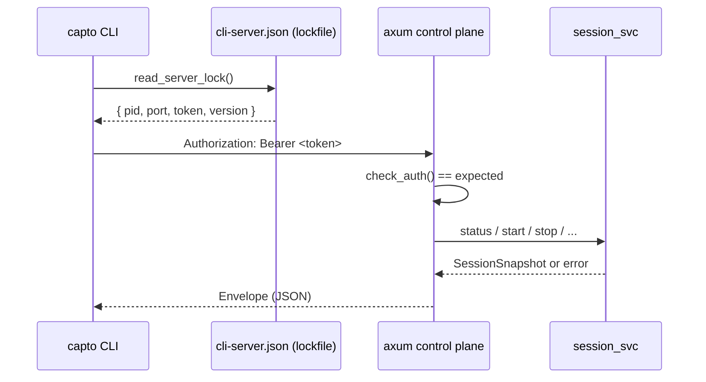

# Control-plane API

Active contributors: elwina

The Capto control plane is the localhost HTTP contract that the desktop app serves and the `capto` CLI consumes. It is the only way an agent, script, or tool can drive a recording without touching the UI. Everything is loopback-bound (`127.0.0.1`), bearer-token authenticated, and wrapped in a small JSON envelope so clients can parse results and branch on stable error codes. The canonical spec is `docs/CLI.md`; this page is the overview.

## Purpose

The API exists so automation can control the desktop recorder the same way a person does: start and stop a capture, take a screenshot, read or patch settings, list capture targets, and inspect outputs. It talks only to the single desktop `RecordingSession`, so one machine always has at most one live capture. The desktop never pushes anything to the cloud, and the API is purely a local `127.0.0.1` HTTP server served by the Tauri shell. Because the desktop is single-process, launching it more than once cannot create a second recorder.

## Mental model

A call follows three steps. The CLI first discovers where the desktop is listening, then connects with its token, then issues an HTTP call that the axum router forwards to the shared session service.



Discovery data lives in `crates/capto-ipc/src/lockfile.rs`. The desktop writes a `ServerLock` (pid, bound port, token, `LOCK_VERSION`) to `%APPDATA%\Capto\cli-server.json` on start (`write_server_lock`) and removes it on shutdown (`clear_server_lock`, called from `shutdown_control_plane`). The CLI reads it with `read_server_lock`, checks `is_pid_alive` to drop a stale lock, then probes `GET /v1/status` to confirm the desktop is actually there before building a client (`crates/capto-cli/src/client.rs::try_existing`).

The server is built in `apps/desktop/src-tauri/src/cli_server.rs`. `start_control_plane` binds `127.0.0.1:0`, grabs an ephemeral port, generates a fresh v4 UUID as the token, writes the lock, and spawns an axum `Router`. Every handler checks `Authorization: Bearer <token>` against the expected value, then delegates to the shared session service in `apps/desktop/src-tauri/src/session_svc.rs`, which is the same code the Tauri UI commands call.

## Auth and token lifecycle

The token is a random UUID created once per desktop run and never persisted beyond the lockfile. Its full lifecycle:

1. `start_control_plane` (`apps/desktop/src-tauri/src/cli_server.rs`) generates `Uuid::new_v4()`, stores it in the in-memory `HttpState`, and writes it into the `ServerLock`.
2. Every request must present `Authorization: Bearer <token>`. `check_auth` compares the extracted value to the expected token byte-for-byte; anything else (missing header, wrong scheme, wrong value) returns HTTP 401 with an `unauthorized` error envelope.
3. When the server exits or the app shuts down, `clear_server_lock` deletes `cli-server.json`, so a killed process leaves no credential behind.

The token is never logged. The `telemetry_layer` middleware records only method, path, status, duration, and request id; bodies, query strings, and auth headers are never part of a log line. The CLI also sends a `x-request-id` header per call, which the desktop echoes back and uses to correlate breadcrumbs. Any error text that could reach output is passed through `capto_ipc::redact` (`crates/capto-ipc/src/redact.rs`), which masks `Bearer <token>` and known secret query keys. See [Security](../security.md) for the rationale.

## Envelope and exit codes

Every response is a single generic shape from `crates/capto-ipc/src/envelope.rs`:

```json
{ "ok": true, "data": { ... } }
```

```json
{ "ok": false, "error": { "code": "stateConflict", "message": "already recording" } }
```

`ok` is the discriminator; `data` and `error` serialize only when present. Error `code` strings are the machine-readable part. The server maps internal error codes to HTTP statuses in `map_err` (`apps/desktop/src-tauri/src/cli_server.rs`): `stateConflict` → 409, `notFound` → 404, `badRequest` → 400, anything else → 500. The CLI then maps `error.code` onto stable process exit codes (`crates/capto-cli/src/main.rs::map_http`):

| Exit code | Meaning | Server error codes that produce it |
|-----------|---------|------------------------------------|
| 0 | ok |, |
| 1 | usage | `badRequest`, `usage` |
| 2 | desktopUnavailable | `unauthorized`, `desktopUnavailable`, unknown |
| 3 | stateConflict | `stateConflict` |
| 4 | capture | `capture` |
| 5 | encode | `encode` |
| 6 | configIo | `configIo` |

The exit codes are the stable part of the contract; branch on the code first, then on `error.code`.

## Endpoint families

All endpoints are under the `API_PREFIX` = `/v1` (`crates/capto-ipc/src/lib.rs`) and require the bearer token.

| Family | Method & path | Purpose | Primary types |
|--------|---------------|---------|---------------|
| Status | `GET /v1/status` | Current session snapshot | `SessionSnapshot` |
| Doctor | `GET /v1/doctor` | Readiness / environment probe | `DoctorInfo` |
| Config | `GET /v1/config` | Full current settings | `AppSettings` |
| Config | `PATCH /v1/config` | Partial patch + hotkey re-register | `AppSettings` |
| Config | `GET /v1/config/path` | Settings file path | `ConfigPathInfo` |
| Record | `POST /v1/record/start` | Start capture | `RecordStartRequest` → `SessionSnapshot` |
| Record | `POST /v1/record/stop` | Stop capture | `SessionSnapshot` |
| Record | `POST /v1/record/pause` | Pause capture | `SessionSnapshot` |
| Record | `POST /v1/record/resume` | Resume capture | `SessionSnapshot` |
| Shot | `POST /v1/shot` | Screenshot | `ShotRequest` → `{ path }` |
| List | `GET /v1/list/displays` | Capture displays | vendor JSON |
| List | `GET /v1/list/windows` | Capture windows | vendor JSON |
| List | `GET /v1/list/audio` | Mic + loopback devices | vendor JSON |
| List | `GET /v1/list/encoders` | Available FFmpeg encoders | vendor JSON |
| Outputs | `GET /v1/outputs/recent` | Recent output files | `OutputsList` |
| Outputs | `POST /v1/outputs/open` | Open a file or folder | `OpenOutputsRequest` |
| Metrics | `GET /v1/metrics` | Local metrics snapshot | `Metrics` |

The full per-endpoint reference with example payloads and error tables is on [Endpoints](../api/endpoints.md).

## Feature-gated endpoints

### Metrics

`GET /v1/metrics` is gated by the feature flag `CONTROL_PLANE_METRICS` (`"control-plane-metrics"`), declared in `crates/capto-core/src/flags.rs` with a default of `true`. When the flag is disabled the handler returns 404 with a `notFound` error envelope instead of data. The metrics themselves are recorded by the `telemetry_layer` middleware into a local `Metrics` registry (request counters, duration histogram, per-status counters) and are auth-required like every other endpoint. Flags follow the explicit-lists-beat-defaults resolution in `crates/capto-core/src/flags.rs`.

## Versioning

The contract is versioned in two places:

- The URL prefix is fixed at `/v1` (`API_PREFIX` in `crates/capto-ipc/src/lib.rs`). A breaking v2 would move to `/v2` rather than mutate existing routes.
- The lockfile carries `LOCK_VERSION` (currently `1`, from `crates/capto-ipc/src/lockfile.rs`), stamped into every `ServerLock` so an old desktop's lock cannot be mistaken for a current control plane.

`docs/CLI.md` is the canonical documentation for the contract. Opening new endpoints is a routine extension, but changing the semantics of an existing endpoint is a breaking change: it must bump `LOCK_VERSION`, update `docs/CLI.md`, and keep the envelope `ok`/`data`/`error` shape and error `code` strings backwards compatible so an older desktop stays drivable by a newer CLI and vice versa.

## Key source files

| File | Role |
|------|------|
| `apps/desktop/src-tauri/src/cli_server.rs` | axum router, auth, telemetry, lock lifecycle |
| `apps/desktop/src-tauri/src/session_svc.rs` | Handler implementation backed by shared session logic |
| `crates/capto-ipc/src/types.rs` | Request and info types |
| `crates/capto-ipc/src/envelope.rs` | `Envelope`, `ApiError`, `ExitCode` |
| `crates/capto-ipc/src/lockfile.rs` | `ServerLock`, lock lifecycle, `LOCK_VERSION` |
| `crates/capto-ipc/src/redact.rs` | `redact` scrubbing and `REQUEST_ID_HEADER` |
| `crates/capto-cli/src/client.rs` | CLI discovery, retry, error mapping |
| `crates/capto-cli/src/main.rs` | CLI command surface and exit codes |

## Related pages

- [Endpoints](../api/endpoints.md), every route with payloads and error tables
- [capto CLI](../apps/cli.md), the client: commands, exit codes, auto-launch
- [capto-ipc](../crates/capto-ipc.md), envelope, lockfile, shared types
- [capto-core](../crates/capto-core.md), `SessionSnapshot` and `AppSettings` definitions
- [Security](../security.md), token handling, loopback-only, redaction
- [Recording](../features/recording.md), record workflow semantics
- [Architecture](../overview/architecture.md), control plane in the system diagram
