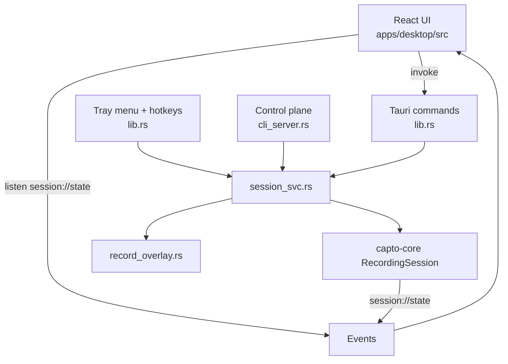

# Desktop app

Active contributors: elwina

## Purpose

The desktop app (`apps/desktop`) is the Tauri 2 shell that owns Capto's single `RecordingSession`. React in `apps/desktop/src` only sends intents and renders state; every frame-level operation happens in Rust inside this crate or the workspace crates it calls. Tray actions, global hotkeys, selection overlays, and the localhost control plane all funnel through the same service layer in `apps/desktop/src-tauri/src/session_svc.rs`, so the `capto` CLI and the mouse never drive the recorder differently.

The binary is `capto-app` (crate `capto-app`); the entry point is `apps/desktop/src-tauri/src/main.rs`, which calls `capto_lib::run()` from `apps/desktop/src-tauri/src/lib.rs`.

## Directory layout

```
apps/desktop/
├── src/                            # React 19 SPA; see react-ui.md
│   ├── App.tsx                     # window-label routing + main UI
│   ├── components/                 # panels, pickers, overlay runtime
│   ├── hooks/                      # preview polling hooks
│   ├── i18n/locales/               # 10 locale JSON files
│   └── styles/app.css
├── src-tauri/
│   ├── src/
│   │   ├── main.rs                 # capto_lib::run()
│   │   ├── lib.rs                  # Tauri commands, tray, hotkeys, overlays
│   │   ├── session_svc.rs          # service layer shared by commands + control plane
│   │   ├── record_overlay.rs       # recording-time click/key overlay
│   │   ├── cli_server.rs           # axum control plane on 127.0.0.1
│   │   └── crashlog.rs             # panic hook writing crash-<ms>.json
│   ├── binaries/                   # bundled ffmpeg.exe + capto.exe sidecars
│   ├── windows/                    # NSIS installer template + hooks
│   ├── capabilities/
│   ├── Cargo.toml
│   └── tauri.conf.json
└── package.json
```

## Key abstractions

| Type | Location | Role |
|---|---|---|
| `AppState` | `apps/desktop/src-tauri/src/lib.rs` | Process-wide managed state: `session`, `overlay`, `audio_meter`, `hotkey_conflicts`, `metrics` |
| `StartArgs` / `ShotArgs` | `apps/desktop/src-tauri/src/lib.rs` | Tauri intent DTOs mirroring `RecordStartRequest` / `ShotRequest` from capto-ipc |
| `PreviewFrame`, `WebcamSoloFrame`, `MaskRect` | `apps/desktop/src-tauri/src/lib.rs` | serde camelCase payloads handed to React for preview rendering |
| `FfmpegInfo`, `PlatformInfo`, `CaptoFfmpegMeta` | `apps/desktop/src-tauri/src/lib.rs` | FFmpeg sidecar diagnosis payloads for the About tab |
| `RecordOverlayController` | `apps/desktop/src-tauri/src/record_overlay.rs` | Transparent overlay window plus LL input hook pump for click/key effects |
| `CrashReport` | `apps/desktop/src-tauri/src/crashlog.rs` | Structure written to `crash-<ms>.json` on panic |
| `HttpState` | `apps/desktop/src-tauri/src/cli_server.rs` | Control-plane auth state: bearer token, port, metrics, hotkey re-registration callback |

All command and service functions return `Result<_, String>` with thiserror-style messages; React and the CLI both surface the same text. Every request/response type that crosses the process boundary is serde camelCase.

## How it works

The shell is one `tauri::Builder` in `apps/desktop/src-tauri/src/lib.rs`. On startup it installs the tracing filter and panic hook, registers plugins (`tauri-plugin-single-instance` first, then dialog, opener, process, global-shortcut, and updater on desktop), then in `setup` it resolves the FFmpeg sidecar, loads settings, builds a `RecordingSession`, and manages an `AppState`. The single-instance plugin means a second launch unminimizes and focuses the existing main window instead of spawning another process, which is what guarantees one recording session per machine. Finally it creates the tray, registers hotkeys, and starts the axum control plane. Four input channels drive the same `session_svc` layer:



Tauri commands, tray menu items, global hotkeys, and `/v1/*` HTTP handlers all call `session_svc` functions such as `start_recording`, `pause_recording`, `resume_recording`, `stop_recording`, and `take_screenshot`. The service emits a `session://state` event after each transition, so the webview and the CLI see the same `SessionSnapshot` (see [capto-core](../../crates/capto-core.md) for the state machine).

### Command surface

`apps/desktop/src-tauri/src/lib.rs` declares the full command list in `invoke_handler`: `get_settings`, `save_settings`, `get_hotkey_conflicts`, `default_output_dir`, `list_displays`, `list_windows`, `list_audio_devices`, `list_webcams`, `list_encoders`, `get_session_state`, `get_audio_levels`, `start_audio_meter`, `stop_audio_meter`, `start_recording`, `pause_recording`, `resume_recording`, `stop_recording`, `take_screenshot`, `capture_preview`, `capture_webcam_preview`, `release_preview_webcam`, `release_preview_session`, `get_overlay_defaults`, `get_platform_info`, `get_ffmpeg_info`, `open_output_folder`, `window_under_cursor`, `open_window_picker`, `close_window_picker`, `open_region_picker`, `close_region_picker`, `cursor_position`, `get_virtual_screen`, and `get_window_label`.

Start and screenshot intents use `StartArgs` and `ShotArgs`, `#[derive(Deserialize)]` DTOs with `#[serde(rename_all = "camelCase")]`, whose `From` impls convert straight into `RecordStartRequest` and `ShotRequest` from capto-ipc. `start_recording` delegates to `session_svc::start_recording`, which builds a `RecordRequest` with settings fallbacks (for example `default_display_id`, `default_region`, `preferred_encoder`), stops any running audio meter, calls `session.start(req)`, hides the main window when `hide_app` is set, and starts the `RecordOverlayController` (see `apps/desktop/src-tauri/src/session_svc.rs`).

### Tray and global shortcuts

The tray is built in `setup` with six `MenuItem`s (`show`, `start`, `pause`, `stop`, `shot`, `quit`) labeled by `tray_labels()`, which returns localized strings for 10 locales (Chinese simplified/traditional, Japanese, Korean, German, French, Spanish, Portuguese, Russian, English) based on `settings.locale`. A left-click on the tray icon shows and focuses the main window; `quit` shuts down the control plane and exits. Closing the window does not exit: `on_window_event` in `apps/desktop/src-tauri/src/lib.rs` intercepts `CloseRequested`, calls `api.prevent_close()`, and hides the window instead, so the app keeps running in the tray. The related `minimizeToTrayOnClose` setting (default true in `crates/capto-core/src/settings.rs`) is exposed as a checkbox and persisted with the rest of settings, though the close handler itself does not consult it.

`register_hotkeys` in `apps/desktop/src-tauri/src/lib.rs` normalizes the saved bindings with `capto_hooks::normalize_hotkeys` (see [capto-hooks](../../crates/capto-hooks.md)), calls `unregister_all`, then registers each enabled binding via `parse_hotkey_shortcut` (maps modifier names like `Control`, `Alt`, `Super` and keys A-Z, 0-9, F1-F12 to `tauri_plugin_global_shortcut` codes). When registration fails, the shortcut is recorded in `hotkey_conflicts` and registration continues, so one unavailable binding never blocks the rest. The `hotkey_*` handlers read the session state and only act when it makes sense: start only from `Idle` or `Paused`, pause only while `Recording`, stop from `Recording`/`Paused`/`Starting`, screenshot with `default_source` plus `default_display_id` or `default_region`. Each hotkey press records a breadcrumb and increments a metric. The conflict list is exposed to React via `get_hotkey_conflicts` and re-computed on every settings save when hotkeys changed (`apps/desktop/src-tauri/src/session_svc.rs`). See [hotkeys](../../features/hotkeys.md) for the user-visible behavior.

### Selection overlays

Window and region pickers are full-screen transparent Tauri windows, one per physical monitor, created by `open_overlay_windows` in `apps/desktop/src-tauri/src/lib.rs`. A single window spanning the virtual desktop breaks on secondary or mixed-DPI screens, so the code enumerates `capto_capture::list_monitor_rects()` (falling back to the virtual screen) and builds one `WebviewWindowBuilder` per monitor, labeled `picker-{gen}-{i}` or `region-picker-{gen}-{i}`. `OVERLAY_GENERATION` is an `AtomicU64` bumped on every open because reusing a closed label like `region-picker-0` fails on Windows. The overlay under the cursor gets focus. The main window hides while a picker is open; `close_all_selection_overlays` closes both picker kinds and waits in a 20 ms retry loop until the labels are actually gone, because window destroy is async on Windows. The pickers themselves are React components described in [react-ui.md](react-ui.md).

### Preview capture

`capture_preview` produces a low-resolution JPEG of the chosen target for the preview stage. It captures through `capto_capture::capture_preview_frame` (DXGI Desktop Duplication, so the system cursor is not flickered), then calls `frame.blackout_rect` over the app's own window rectangle when the app is visible, returning a `MaskRect` normalized to 0..1 so the UI can badge the masked area at any scale. The result is downscaled with `preview_jpeg(480, 55)` and sent to React as bytes. `capture_webcam_preview` serves the Webcam tab: it ensures a Media Foundation preview webcam, swaps BGRA to RGBA (MF stores BGRA in `Frame.rgba`), mirrors the frame in place when `cam.mirrored` is set, and JPEG-encodes at `preview_jpeg(480, 72)`. `release_preview_webcam` and `release_preview_session` free those capture slots, and `window_under_cursor`, `cursor_position`, and `get_virtual_screen` back the pickers.

### FFmpeg sidecar discovery

`sidecar_dir` in `apps/desktop/src-tauri/src/lib.rs` walks a candidate list: `src-tauri/binaries` next to the crate, the Tauri resource dir (`binaries` and the dir itself), the app exe's parent (for installed/portable layouts where Tauri externalBin lands next to the exe), and `parent/../../apps/desktop/src-tauri/binaries` for the workspace `target/debug` layout. The first directory where `capto_encode::FfmpegEncoder::dir_has_ffmpeg` is true wins. `list_encoders` refreshes the encoder and probes available hardware encoders through the sidecar; `get_ffmpeg_info` reports availability, the bundle tag from `capto-ffmpeg.json` or the pinned values in `.github/capto-ffmpeg.env` (`CAPTO_FFMPEG_REPO` / `CAPTO_FFMPEG_TAG`), and the first `ffmpeg -version` line, with `display_path` stripping Win32 `\\?\` and `\\.\` prefixes for UI display.

### Control plane and crash reporting

`start_control_plane` in `apps/desktop/src-tauri/src/cli_server.rs` binds `127.0.0.1:0`, writes the lockfile (`ServerLock` from capto-ipc) with pid, port, token, and version, and spawns an axum server routing `/v1/*` to `session_svc` functions behind a bearer-token check. A `telemetry_layer` middleware echoes an `x-request-id`, records request counters and durations into the local metrics registry, and appends scrubbed request breadcrumbs (method, path, status, request id only). The full endpoint map lives in [Control-plane API](../../api/index.md). The lockfile is cleared on `quit`, on process exit (`RunEvent::Exit`), and when the server task ends.

`crashlog.rs` installs a panic hook (unless the `crash-reporting` feature flag is off) that writes `crash-<ms>.json` into `<config>/Capto/crashes` together with pid, uptime, active feature flags, the breadcrumb trail, and the last control-plane request id. Writing is best-effort and never blocks the panic handler.

## Integration points

- `session_svc` is shared by Tauri commands (`apps/desktop/src-tauri/src/lib.rs`), tray/hotkey handlers, and the control plane (`apps/desktop/src-tauri/src/cli_server.rs`); the same `start_recording`/`stop_recording` code path serves the mouse and the CLI.
- Session state is pushed to React as `session://state` events and polled as a fallback; settings saves emit `settings://changed` (`apps/desktop/src-tauri/src/session_svc.rs`).
- Hotkey registration depends on `capto_hooks::normalize_hotkeys` ([capto-hooks](../../crates/capto-hooks.md)); conflict reporting and lockfile types come from capto-ipc ([capto-ipc](../../crates/capto-ipc.md)).
- The shell drives `RecordingSession` from capto-core ([capto-core](../../crates/capto-core.md)), preview and picking from capto-capture ([capto-capture](../../crates/capto-capture.md)), and encoding through capto-encode. See [architecture](../../overview/architecture.md) for the end-to-end pipeline.
- `apps/desktop/src-tauri/tauri.conf.json` defines the `main` window (460x760, min 420x640), bundles `binaries/ffmpeg` as `externalBin`, ships `binaries/capto-ffmpeg.json` and `binaries/capto.exe` as resources, and configures the NSIS installer and updater endpoints.

## Entry points for modification

- New Tauri command: add the `#[tauri::command]` function in `apps/desktop/src-tauri/src/lib.rs` and append it to the `invoke_handler!` list; if the control plane should expose it too, add a route plus handler in `apps/desktop/src-tauri/src/cli_server.rs` and a `session_svc` function.
- Change what a record start does: `start_recording` in `apps/desktop/src-tauri/src/session_svc.rs`.
- Change picker or overlay window behavior: `open_overlay_windows` / `close_all_selection_overlays` in `apps/desktop/src-tauri/src/lib.rs` and `RecordOverlayController` in `apps/desktop/src-tauri/src/record_overlay.rs`.
- Add a tray language: `tray_labels` in `apps/desktop/src-tauri/src/lib.rs` plus the matching locale JSON in `apps/desktop/src/i18n/locales/`.
- Change crash reporting: `apps/desktop/src-tauri/src/crashlog.rs`.

## Key source files

| File | Purpose |
|---|---|
| `apps/desktop/src-tauri/src/lib.rs` | Tauri builder, `AppState`, all commands, tray + locale labels, hotkey registration, overlay windows, FFmpeg discovery, preview commands |
| `apps/desktop/src-tauri/src/session_svc.rs` | Shared session operations used by commands and the control plane |
| `apps/desktop/src-tauri/src/record_overlay.rs` | Recording-time click/key overlay controller and event pump |
| `apps/desktop/src-tauri/src/cli_server.rs` | axum control plane, bearer auth, telemetry middleware, lockfile |
| `apps/desktop/src-tauri/src/crashlog.rs` | Panic hook and crash report writer |
| `apps/desktop/src-tauri/src/main.rs` | Binary entry point calling `capto_lib::run()` |
| `apps/desktop/src-tauri/tauri.conf.json` | Window, bundle, updater, and plugin configuration |
| `apps/desktop/src-tauri/Cargo.toml` | Tauri and workspace crate dependencies |
