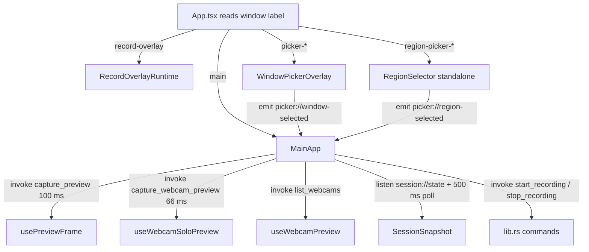

# React UI

Active contributors: elwina

## Purpose

The React app in `apps/desktop/src` is the desktop's front end: it sends intents to Rust via Tauri commands, listens for native events, and renders state. It never processes frames. Native code produces finished JPEGs, and the browser only turns them into blob URLs. The same HTML bundle also powers the special windows Rust creates (selection pickers and the recording overlay); `apps/desktop/src/App.tsx` routes by window label.

## Directory layout

```
apps/desktop/src/
├── App.tsx                 # window-label routing + MainApp (record tabs, toolbar, previews)
├── main.tsx                # React root
├── overlays.ts             # overlay-layout settings types (loose, dotted-path patched)
├── components/             # panels, pickers, overlay runtime, settings blocks
├── hooks/                  # usePreviewFrame, useWebcamPreview, useWebcamSoloPreview
├── i18n/
│   ├── index.ts            # i18next init + SUPPORTED_LOCALES
│   └── locales/            # 10 locale JSON files
└── styles/app.css          # ~24 KB of component styles
```

## Key abstractions

| Type | Location | Role |
|---|---|---|
| `App` (default export) | `apps/desktop/src/App.tsx` | Reads the window label and renders the matching surface |
| `MainApp` | `apps/desktop/src/App.tsx` | Five tabs (main, webcam, overlays, settings, about), toolbar, session/settings state |
| `usePreviewFrame` | `apps/desktop/src/hooks/usePreviewFrame.ts` | Polls `capture_preview` every 100 ms, produces blob-URL JPEGs |
| `useWebcamPreview` | `apps/desktop/src/hooks/useWebcamPreview.ts` | Fetches the webcam device list via `list_webcams` |
| `useWebcamSoloPreview` | `apps/desktop/src/hooks/useWebcamSoloPreview.ts` | Polls `capture_webcam_preview` at ~66 ms for the Webcam tab |
| `HotkeySettings` | `apps/desktop/src/components/HotkeySettings.tsx` | Rebind UI for the four global hotkeys, with conflict display |
| `WindowPickerOverlay` | `apps/desktop/src/components/WindowPickerOverlay.tsx` | Hover-highlight window picker driven by `window_under_cursor` |
| `RegionSelector` | `apps/desktop/src/components/RegionSelector.tsx` | Drag-to-select region picker using `cursor_position` |
| `RecordOverlayRuntime` | `apps/desktop/src/components/RecordOverlayRuntime.tsx` | Renders click ripples and keystroke chips from `overlay://` events |
| `WebcamPanel`, `OverlayPanel`, `PreviewStage` | `apps/desktop/src/components/` | Webcam PiP settings, overlay-layout settings, and the preview stage |

## How it works

Every Tauri window loads the same bundle (`apps/desktop/index.html`), so `App.tsx` first resolves the current window label, preferring `getCurrentWindow()` from `@tauri-apps/api/window` and falling back to the `get_window_label` command. It toggles `picker-mode` or `record-overlay-mode` classes on `<html>`, then dispatches:



The picker overlays never start recording; they emit `picker://window-selected` or `picker://region-selected`, which `MainApp` listens for, applies to its local state, persists as defaults via `save_settings`, and switches back to the main tab. Rust handles the visibility dance (hide main, create one window per monitor) through `open_window_picker` / `open_region_picker` (see [index.md](index.md)).

### MainApp state and refresh

`MainApp` keeps a large piece of `useState` mirroring `AppSettings` (`apps/desktop/src/App.tsx`), plus session, display, audio, encoder, source, region, and picker state. The `refresh` callback hydrates everything at once with a `Promise.all` over `get_settings`, `list_displays`, `list_audio_devices`, `get_session_state`, `list_windows` (tolerated if it fails), and `get_hotkey_conflicts`, then probes `list_encoders` separately and switches the i18n locale when `settings.locale` differs. The toolbar, toggles for cursor/mouse clicks/keystrokes/preview, source tiles (display/window/region/webcam PiP), encoder and format controls, and media rows all live in this component.

### Polling versus events

Session state arrives two ways: Rust emits `session://state` after every transition, and `MainApp` also polls `get_session_state` every 500 ms as a fallback (`apps/desktop/src/App.tsx`). Audio levels are polled at 100 ms only while recording or during the audio test, and the linear WASAPI peak is mapped to a -60 dBFS..0 dBFS meter. Previews are the only other hot loop: `usePreviewFrame` polls `capture_preview` at 100 ms when the stage is visible (main or webcam tab, not busy, format not audioOnly), and `useWebcamSoloPreview` polls `capture_webcam_preview` at 66 ms on the Webcam tab. Both hooks revoke stale object URLs and drop the raw bytes from React state. `usePreviewFrame` also calls `release_preview_session` when disabled or unmounted; `useWebcamSoloPreview` deliberately does not, because the recorder may take ownership of the same Media Foundation camera next for a zero-gap PiP start.

### Saving settings

Three save paths exist in `apps/desktop/src/App.tsx`. `saveSettings` writes immediately (optimistic UI first). `saveSettingsLive` coalesces rapid changes with a 400 ms timer, used for PiP drags and sliders. `flushSettings` clears the timer and writes synchronously before `start_recording`, so the recording sees the latest webcam PiP config. `persistMainPrefs` saves home-tab choices (source, encoder, audio devices, fps, quality) on change, and `patchOverlay` walks dotted paths like `mouseClicks.leftColor` into the loose `OverlaysSettings` blob from `apps/desktop/src/overlays.ts`.

### Panels and pickers

- `HotkeySettings` (`apps/desktop/src/components/HotkeySettings.tsx`) ensures four bindings with the defaults Alt+F5..F8, captures a new binding from a `keydown` while listening, requires at least one modifier, blocks bare Alt+F4, rejects duplicates, and marks bindings that appear in the `conflicts` list from `get_hotkey_conflicts` as unavailable.
- `WindowPickerOverlay` (`apps/desktop/src/components/WindowPickerOverlay.tsx`) polls `window_under_cursor` at 40 ms, highlights the hovered window by converting physical `GetWindowRect` coordinates to logical DIPs using the overlay's `scaleFactor`, and emits the picked window on click. Esc calls `close_window_picker`.
- `RegionSelector` (`apps/desktop/src/components/RegionSelector.tsx`) reads the cursor through `cursor_position` to anchor a drag in physical coordinates, requires a minimum 8 px box, and in standalone mode emits `picker://region-selected` before closing.
- `RecordOverlayRuntime` (`apps/desktop/src/components/RecordOverlayRuntime.tsx`) listens for `overlay://click`, `overlay://key`, and `overlay://clear`. Click ripples expire after 550 ms; keystroke chips replace a same-label chip and expire after 1800 ms. It supports 8-digit hex colors from settings via a small CSS conversion.
- `WebcamPanel` (`apps/desktop/src/components/WebcamPanel.tsx`) is the webcam tab: device picker from `useWebcamPreview`, mirror toggle, anchor grid (topLeft/topRight/bottomLeft/bottomRight/center), width/height/cornerRadius, a solo MF preview via `useWebcamSoloPreview` (paused while recording so the encoder owns the camera), and error text mapping (busy, denied, not found, unsupported).
- `PreviewStage` (`apps/desktop/src/components/PreviewStage.tsx`) lays out the JPEG on a resizable stage, computes the webcam PiP box from `OverlayWebcam` position/size (scaled into the reduced preview), draws the camera-icon placeholder, and badges the app-masked region returned in `MaskRect` with the Capto mark.
- `OverlayPanel` (`apps/desktop/src/components/OverlayPanel.tsx`) plus `OverlayPreview` (`apps/desktop/src/components/OverlayPreview.tsx`) edit mouse-click colors, keystroke font size, and any text/image overlays, with a live CSS mock of the layout.
- `AboutPanel` (`apps/desktop/src/components/AboutPanel.tsx`) shows app version, FFmpeg bundle/version/path via `get_ffmpeg_info`, license and repo links, and a donation QR. `UpdateSettings` (`apps/desktop/src/components/UpdateSettings.tsx`) drives `@tauri-apps/plugin-updater`: check, `downloadAndInstall` with progress, then `relaunch` via the process plugin.

### i18n

`apps/desktop/src/i18n/index.ts` exports `SUPPORTED_LOCALES`, ten BCP 47 tags (en, zh-CN, zh-TW, ja, ko, de, fr, es, pt-BR, ru) with native labels, and initializes i18next with `en` as fallback. Locale JSON lives in `apps/desktop/src/i18n/locales/`. The Rust tray labels are mirrored manually in `tray_labels` in `apps/desktop/src-tauri/src/lib.rs`; the UI locale is persisted as `settings.locale`.

## Integration points

- Every intent crosses the bridge as a Tauri command with camelCase args; recording uses the `args` object matching `StartArgs` from `apps/desktop/src-tauri/src/lib.rs`, and screenshots use the `ShotArgs` shape.
- Events from Rust: `session://state` (session transitions), `settings://changed` (settings saves), `picker://window-selected`, `picker://region-selected` (emitted by the pickers themselves), `overlay://click` / `overlay://key` / `overlay://clear` (from `apps/desktop/src-tauri/src/record_overlay.rs`).
- Preview JPEGs come from `capture_preview` and `capture_webcam_preview` in [index.md](index.md); the underlying capture and webcam work sits in capto-capture ([capto-capture](../../crates/capto-capture.md)).
- The session semantics the UI drives are defined by `RecordingSession` in capto-core ([capto-core](../../crates/capto-core.md)); global hotkey behavior is documented in [hotkeys](../../features/hotkeys.md). The end-to-end flow is in [architecture](../../overview/architecture.md).

## Entry points for modification

- New tab or panel: add a component under `apps/desktop/src/components/`, a locale key in the JSON files under `apps/desktop/src/i18n/locales/`, and mount it in `MainApp` in `apps/desktop/src/App.tsx`.
- Change preview cadence or content: `usePreviewFrame` / `useWebcamSoloPreview` in `apps/desktop/src/hooks/`, backed by the native `capture_preview` commands.
- Change hotkey capture rules: `shortcutFromEvent`, `normalizeShortcutKey`, and `ensureFour` in `apps/desktop/src/components/HotkeySettings.tsx`.
- Overlay visuals: `RecordOverlayRuntime` for runtime effects, `OverlayPreview` for the settings mock.

## Key source files

| File | Purpose |
|---|---|
| `apps/desktop/src/App.tsx` | Window-label routing, `MainApp` with all five tabs, settings save paths, session polling |
| `apps/desktop/src/hooks/usePreviewFrame.ts` | Screen preview polling and blob-URL management |
| `apps/desktop/src/hooks/useWebcamPreview.ts` | Webcam device list |
| `apps/desktop/src/hooks/useWebcamSoloPreview.ts` | Webcam tab live preview polling |
| `apps/desktop/src/components/HotkeySettings.tsx` | Hotkey rebind UI + defaults (Alt+F5..F8) |
| `apps/desktop/src/components/WindowPickerOverlay.tsx` | Window selection overlay |
| `apps/desktop/src/components/RegionSelector.tsx` | Region selection overlay |
| `apps/desktop/src/components/RecordOverlayRuntime.tsx` | Click/key overlay rendering |
| `apps/desktop/src/components/WebcamPanel.tsx` | Webcam PiP settings + solo preview |
| `apps/desktop/src/components/PreviewStage.tsx` | Live preview stage with PiP guide and app-mask badge |
| `apps/desktop/src/components/OverlayPanel.tsx`, `OverlayPreview.tsx` | Overlay-layout settings and mock |
| `apps/desktop/src/i18n/index.ts` | i18next init and `SUPPORTED_LOCALES` |
| `apps/desktop/src/overlays.ts` | Overlay settings types |
