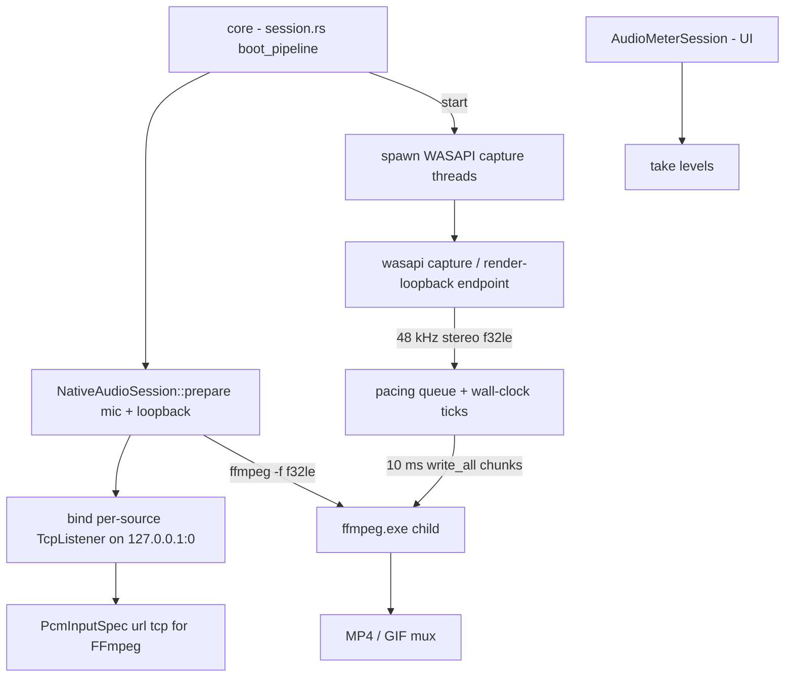

# capto-audio

Active contributors: elwina

## Purpose

`crates/capto-audio` owns native audio capture for Capto. It opens WASAPI endpoints (a capture endpoint for the mic, a render endpoint with loopback for system sound), normalizes everything to 48 kHz stereo float PCM, and streams it to the FFmpeg child over a per-source localhost TCP connection so FFmpeg's stdin stays free for the `q` command. It also exposes a lightweight metering session for the UI both before and during a take. The trait surface and the metering API are the same on non-Windows platforms, where the native backends are stubs until implemented.

## Directory layout

| File | Role |
|------|------|
| `crates/capto-audio/src/lib.rs` | Shared error, device/level types, `PcmInputSpec`, the cpal-based `list_devices` for non-Windows, and the non-Windows placeholder sessions |
| `crates/capto-audio/src/windows.rs` | Windows implementation: `NativeAudioSession`, `AudioMeterSession`, WASAPI capture threads, PCM pacing, device enumeration |

## Key abstractions

| Abstraction | Where | What it does |
|-------------|-------|--------------|
| `NativeAudioSession` | `crates/capto-audio/src/windows.rs` | Owns WASAPI capture threads and their localhost PCM transports used during a recording; `prepare` (bind TCP listeners), `inputs` (f32le specs for FFmpeg), `start` (spawn and wait for WASAPI init), `set_paused`, `levels`, `stop`, plus `Drop` that stops threads |
| `AudioMeterSession` | `crates/capto-audio/src/windows.rs` | Short-lived WASAPI monitor for UI level metering before recording; reuses the same endpoint-opening code path via `meter_thread` |
| `AudioLevels` | `crates/capto-audio/src/lib.rs` | Recent peak levels `{ microphone, system }` normalized to `0.0..=1.0`, serialized camelCase |
| `AudioDeviceInfo` | `crates/capto-audio/src/lib.rs` | A discoverable device: `id`, `name`, `kind`, `is_default` |
| `AudioDeviceKind` | `crates/capto-audio/src/lib.rs` | `Input`, `Output`, `Loopback` |
| `AudioError` | `crates/capto-audio/src/lib.rs` | `Device`, `NoHost`, `Transport` variants |
| `PcmInputSpec` | `crates/capto-audio/src/lib.rs` | One native PCM stream exposed to FFmpeg: `kind`, `url` (`tcp://127.0.0.1:<port>`), `sample_rate`, `channels` |
| `list_devices` | `crates/capto-audio/src/windows.rs` | Enumerates capture and render endpoints; render endpoints are offered as loopback sources |

## How it works

`NativeAudioSession::prepare` binds one non-blocking TCP listener per requested source (mic capture or render loopback) on `127.0.0.1:0` and records the port in each `PcmInputSpec`. `start` spawns one thread per source named `capto-wasapi-mic` or `capto-wasapi-loopback`, waits on a sync channel for each to finish COM initialization (a 5-second timeout produces an error), and hands the specs to the caller. FFmpeg connects as the TCP client and consumes `f32le`, 48 kHz stereo.

Each capture thread initializes MTA COM, enumerates the device collection, and matches on the stable WASAPI endpoint ID (a deliberate workaround for a `wasapi` crate lifetime bug in `get_device`). A render endpoint initialized for capture sets `AUDCLNT_STREAMFLAGS_LOOPBACK`, which is what captures system sound. The stream is opened in events-shared mode at 48 kHz stereo float, so `autoconvert: true` handles device format differences.

### Pacing so audio never starves or fast-forwards

The capture thread reads packets and pushes PCM into a `VecDeque` queue, then drains it in 10 ms chunks (`CHUNK_FRAMES = 480` at 48 kHz) against a wall-clock `next_tick`. Two boundaries keep the record stable:

- **No starvation**: if capture falls behind video, old queued samples are dropped so audio stays synchronized with the video clock rather than drifting behind. A write that hits `WouldBlock` or `TimedOut` sleeps a millisecond instead of aborting, so a brief FFmpeg stall during video init does not kill the mic for the whole take.
- **No fast-forward**: chunks are drained only when wall clock reaches `next_tick`; if the loop falls behind by more than 100 ms it resets `next_tick` so audio never rushes to catch up.

If a packet carries the WASAPI silent flag, matching silence (zeros) is enqueued so the timeline is not shortened.

### Pause, resume, and metering

`set_paused` sets an atomic flag that makes the thread clear the queue and skip writes while paused, so FFmpeg's sample clock and the video CFR skip that wall time together (soft-pause, not a stream pause). `levels` reports peak metering: each thread updates an atomic `LevelMeters` slot (monotonic so bars rise fast and fall on read) and `take` returns and resets the peaks.

`AudioMeterSession` is the pre-record meter. `AudioMeterSession::start` opens the same endpoints but only computes peaks in `meter_thread` and exposes `levels()` / `stop()`; its `Drop` stops threads too, so it never needs to be driven by the UI beyond crate state.

## Integration

- `boot_pipeline` in `crates/capto-core/src/session.rs` calls `NativeAudioSession::prepare(mic, loopback)` for non-GIF recordings, collects `PcmInputSpec` from `audio_session.inputs()`, and passes them into the record argv. On start it calls `audio.start()` and, on stop, `audio.stop()`. `rec.audio_session.as_ref().set_paused(...)` drives pause/resume from the desktop commands.
- The f32le tuples from `PcmInputSpec` become `-f f32le -ar 48000 -ac 2` input arguments for the FFmpeg child alongside the DXGI video input; see [recording](../features/recording.md) for the end-to-end pipeline.
- The desktop surfaces diagnostics and device lists through Tauri commands in `apps/desktop/src-tauri/src/lib.rs`: `get_audio_levels` reads the live recording's `AudioLevels`, and `start_audio_meter` runs an `AudioMeterSession` against the selected mic and loopback devices.
- The CLI record paths (`record start --mic/--loopback`) resolve device selections and thread them through the same `boot_pipeline`; see [CLI.md](../../docs/CLI.md).
- See [capto-core](capto-core.md) for how `RecordingSession` owns the audio session, and [audio-capture](../features/audio-capture.md) for the user-facing story.

## Entry points for modification

- **Native capture behavior**: `capture_thread`, `meter_thread`, and `write_all_pcm` in `crates/capto-audio/src/windows.rs`.
- **Format or pacing**: `SAMPLE_RATE`, `CHANNELS`, `BYTES_PER_FRAME`, `CHUNK_FRAMES`, and the queue/`next_tick` logic in `crates/capto-audio/src/windows.rs`.
- **Device identity and enumeration**: `list_devices` / `list_devices_inner` and `parse_device_id` in `crates/capto-audio/src/windows.rs`.
- **Public types**: `AudioError`, `AudioLevels`, `AudioDeviceInfo`, `AudioDeviceKind`, `PcmInputSpec` in `crates/capto-audio/src/lib.rs`.
- **Non-Windows backends**: implement `list_devices`, `NativeAudioSession`, and `AudioMeterSession` behind `#[cfg(not(windows))]` in `crates/capto-audio/src/lib.rs` (currently placeholders).

## Key source files

| File | What to look for |
|------|------------------|
| `crates/capto-audio/src/lib.rs` | Shared error, device/level/spec types, non-Windows placeholders |
| `crates/capto-audio/src/windows.rs` | `NativeAudioSession`, `AudioMeterSession`, WASAPI capture/loopback threads, PCM pacing, metering, device enumeration |
| `crates/capto-core/src/session.rs` | `boot_pipeline` prepare/start/stop, `set_paused` on pause/resume, `audio_levels()` |
| `apps/desktop/src-tauri/src/lib.rs` | `get_audio_levels`, `start_audio_meter` Tauri commands |
