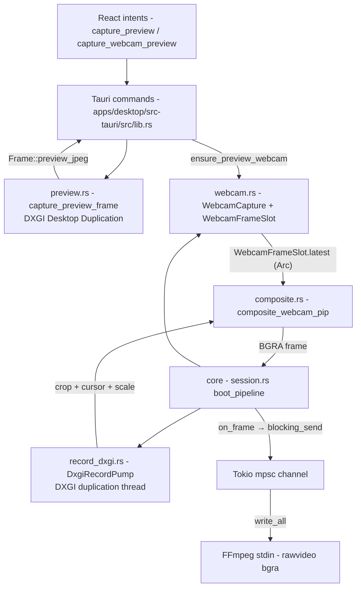

# capto-capture

Active contributors: elwina

## Purpose

`crates/capto-capture` is the platform capture abstraction for Capto. It owns four jobs:

- **Still capture** through the `CaptureBackend` trait: display, window, and region frames that feed screenshots and non-Windows previews, backed by the `xcap` crate.
- **Live UI preview** through `capture_preview_frame` in `crates/capto-capture/src/preview.rs`, using DXGI Desktop Duplication so the system cursor never flickers.
- **The recording frame pump**: `DxgiRecordPump` in `crates/capto-capture/src/record_dxgi.rs` delivers BGRA frames as fast as the encoder can eat them, feeding FFmpeg's stdin on a Tokio channel.
- **Webcam capture** through Media Foundation in `crates/capto-capture/src/webcam.rs`, composited as a picture-in-picture into record frames.

The crate also owns geometry helpers (`crates/capto-capture/src/desktop.rs`) that keep window, region, and PiP coordinates correct on mixed-DPI multi-monitor setups. Windows is the only fully implemented target: the DXGI pump, the MF webcam, and the HWND pickers all return `CaptureError::Unsupported` elsewhere.

## Directory layout

| File | Role |
|------|------|
| `crates/capto-capture/src/lib.rs` | Shared types (`CaptureError`, `DisplayInfo`, `WindowInfo`, `CaptureTarget`, `Frame`, `PixelRect`) plus module re-exports |
| `crates/capto-capture/src/backend.rs` | `CaptureBackend` trait, `XcapCaptureBackend`, `UnsupportedCaptureBackend`, `create_default_backend` |
| `crates/capto-capture/src/desktop.rs` | Virtual desktop geometry in physical pixels: `virtual_screen`, `list_monitor_rects`, `list_windows`, `window_by_id`, `cursor_position`, `monitor_index_for_rect`, `VirtualScreen`/`ScreenPoint` |
| `crates/capto-capture/src/preview.rs` | DXGI Desktop Duplication live preview: `capture_preview_frame`, `release_preview_session` |
| `crates/capto-capture/src/record_dxgi.rs` | `DxgiRecordPump` blocking DXGI frame pump plus `RecordPip` compositing metadata |
| `crates/capto-capture/src/webcam.rs` | Media Foundation webcam: `WebcamCapture`, `WebcamFrameSlot`, `ensure_preview_webcam`, `take_webcam_for_record`, `list_webcams` |
| `crates/capto-capture/src/composite.rs` | `composite_webcam_pip` PiP blit and `swap_rb_inplace` |
| `crates/capto-capture/src/pick.rs` | HWND hit-testing (`window_under_cursor`) and a GDI window-still helper (`capture_window_by_id`) |

## Key abstractions

| Abstraction | Where | What it does |
|-------------|-------|--------------|
| `CaptureBackend` | `crates/capto-capture/src/backend.rs` | Platform-agnostic trait: `platform_name`, `list_displays`, `list_windows`, `capture_frame`, optional `supports_streaming`. New OS backends implement this. |
| `XcapCaptureBackend` | `crates/capto-capture/src/backend.rs` | xcap-backed implementation for stills and lists. On Windows, `list_windows` delegates to the HWND-based enumerator instead of xcap, because xcap enumeration can be rejected wholesale by protected UWP surfaces. |
| `UnsupportedCaptureBackend` | `crates/capto-capture/src/backend.rs` | Stub for unbuilt OS paths; every call fails with `CaptureError::Unsupported` and a hint string. |
| `CaptureTarget` | `crates/capto-capture/src/lib.rs` | Serialized enum `Display { id }`, `Window { id }`, `Region { x, y, width, height }`. This is the same type screenshots, previews, and recording resolve. |
| `Frame` | `crates/capto-capture/src/lib.rs` | `width`, `height`, 4-byte `rgba` buffer, `timestamp_ms`, plus `blackout_rect` (paint a clipped rectangle opaque black), `preview_jpeg` (downscale + JPEG encode for the UI), `save_png`. |
| `DxgiRecordPump` | `crates/capto-capture/src/record_dxgi.rs` | Owns a dedicated "capto-dxgi-record" thread that acquires DXGI frames, crops/scales/composites them, and hands owned BGRA buffers to an `on_frame` callback. `set_paused` soft-pauses; `stop` joins the thread. |
| `RecordPip` | `crates/capto-capture/src/record_dxgi.rs` | Holds the `WebcamFrameSlot` plus the `WebcamPip` layout so the pump can composite the webcam in-process before frames reach the encoder. |
| `WebcamCapture` / `WebcamFrameSlot` | `crates/capto-capture/src/webcam.rs` | MF reader on a "capto-webcam" thread; the slot is a shared `Arc<Mutex<Option<Arc<Frame>>>>` that preview and recording both read without copying pixels. |
| `VirtualScreen` / `ScreenPoint` | `crates/capto-capture/src/desktop.rs` | Physical-pixel desktop geometry with `clamp_rect`, `intersection_area`, `to_crop`, `contains_point`; cursor position in the same space. |

## How it works

Two consumers drive capture: the UI preview path and the recording pump.

### UI preview path

The Tauri `capture_preview` command (`apps/desktop/src-tauri/src/lib.rs`) calls `capture_preview_frame(target)` in `crates/capto-capture/src/preview.rs`. A cached DXGI duplication session (a process-global `Mutex<Option<Session>>`) grabs the monitor with a 200 ms acquire budget; on `Timeout` it returns the last cached frame (an idle desktop often has nothing new), and on `AccessLost` it reopens the duplication API. The result is `(frame, origin)`, where origin is the top-left of the captured content in virtual-screen coordinates. The command then blacks out Capto's own window with `Frame::blackout_rect` and downscales to a JPEG with `Frame::preview_jpeg(480, 55)` (see `crates/capto-capture/src/lib.rs`), so React only ever receives a compressed still plus normalized mask metadata.

### Why Desktop Duplication instead of GDI

The module doc for `crates/capto-capture/src/preview.rs` states the reason directly: GDI `BitBlt` of the desktop DC makes Windows briefly hide the system cursor on every grab (roughly 5 Hz in Capto), which reads as mouse jitter. Desktop Duplication (`DxgiDuplicationApi` from the `windows-capture` crate) does not touch the cursor, so preview and recording are flicker-free.

### Recording pump

`boot_pipeline` in `crates/capto-core/src/session.rs` warms the webcam first (so PiP frames exist from frame 0), spawns FFmpeg, then `attach_dxgi_pump` starts `DxgiRecordPump` on its own thread. Each loop iteration:

1. Acquires the next DXGI frame from the duplication API for the target's monitor.
2. Crops to the target relative to the monitor origin (`crop_bgra`).
3. When `include_cursor` is set, composites just the cursor glyph into a 64x64 scratch DIB with `DrawIconEx`, using the ICONINFO hotspot for placement. This deliberately avoids a full-desktop GDI round trip (see `composite_cursor_bgra` in `crates/capto-capture/src/record_dxgi.rs`).
4. Scales row-wise nearest neighbor to the exact requested output size (`scale_to_exact`), cheaper than per-pixel math in a hot loop.
5. Composites the webcam PiP when enabled.
6. Calls `on_frame(owned_bgra)`, which `capto-core` implements as `tx.blocking_send(...)` into a Tokio `mpsc` channel with capacity 2. Returning `false` (channel closed) stops the pump. A separate spawned task reads the channel and `write_all`s each buffer to FFmpeg's stdin; a write that blocks 250 ms or more is logged as a `slow_writes` diagnostic.

While paused, the pump sleeps instead of pushing frames, so the encode timeline excludes paused wall time and the CFR frame-count PTS stays continuous. Frames are paced by `next_deadline`; if the loop falls behind by more than one frame interval it snaps forward rather than flooding the encoder with a catch-up burst.

### Mixed-DPI geometry

Coordinates must match the `rawvideo` crop FFmpeg consumes, so `crates/capto-capture/src/desktop.rs` works in physical pixels. On mixed-DPI setups, a DPI-unaware thread sees a squashed virtual desktop from `GetSystemMetrics`, which breaks window and region crops. The Windows implementation wraps every call in a `DpiGuard` that sets per-monitor-v2 awareness, enumerates monitors with `EnumDisplayMonitors` (`list_monitor_rects`), and derives the virtual screen as their union (`virtual_screen` in `crates/capto-capture/src/desktop.rs`). `monitor_index_for_rect` picks the monitor with the largest overlap, falling back to the one containing the top-left point, then monitor 0. `VirtualScreen::to_crop` converts a screen rect into even-sized crop coordinates.

The distinction from xcap matters: `XcapCaptureBackend` exposes scaled monitor sizes plus a `scale_factor` on `DisplayInfo`, which is fine for stills, but the record and preview paths deliberately use `desktop.rs` physical rects so window crops and PiP positioning land in the same space as the captured bitmap.

## Webcam capture

The webcam is Media Foundation (`IMFSourceReader`), not `getUserMedia` and not FFmpeg `dshow`. `WebcamCapture::start` in `crates/capto-capture/src/webcam.rs` spawns a "capto-webcam" thread, picks a native YUY2/NV12/RGB32 media type by scoring format bias, size match, and frame rate (30 FPS is the PiP sweet spot), then falls back to asking MF to deliver RGB32 (which may decode MJPG). Frames are converted to BGRA and scaled to the PiP slot size in Rust (`yuy2_to_bgra`, `nv12_to_bgra`, `read_rgb32`). The thread does not sleep on stream ticks, or consumer cameras throttle below ~15 FPS. `start` announces readiness only after the first real frame lands in the slot (8 second timeout), so a recording never starts with a blank PiP and the caller gets an error instead of silence.

The slot model: `ensure_preview_webcam` manages one process-wide preview camera and reuses the running capture when the requested device matches. On the Webcam settings tab, the `capture_webcam_preview` command (`apps/desktop/src-tauri/src/lib.rs`) reads `slot.latest()`, swaps channels with `swap_rb_inplace` from `crates/capto-capture/src/composite.rs` (MF stores BGRA; the JPEG encoder wants RGBA), mirrors if configured, and encodes with `preview_jpeg(480, 72)`.

For recording, `take_webcam_for_record` warms the camera before the encode clock starts. It prefers reusing the live preview capture (same device and at least one frame in the slot) to avoid a long MF reopen gap at the start of the file; otherwise it sleeps 400 ms for the old MF graph to release the device exclusively, opens a fresh capture, and fails if no frames arrive. `composite_webcam_pip` then blits the webcam frame over the record frame per the `WebcamPip` layout (position, size, corner radius, mirror) using `resolve_pixel_position` from `crates/capto-overlay/src/lib.rs`, with a straight row-copy fast path when the sizes already match and no rounding is needed (see `crates/capto-capture/src/composite.rs`).

## Platform story

On macOS and Linux the DXGI pump, MF webcam, and HWND pickers all fail with `CaptureError::Unsupported`; `create_default_backend` still returns `XcapCaptureBackend` for still capture so screenshots and window lists work. The roadmap in `docs/CROSS_PLATFORM.md` is explicit: Windows ships screenshots via xcap, live preview and recording via DXGI duplication, webcam via MF; macOS records via a stub until avfoundation wiring lands; Linux records via a stub until PipeWire or x11grab wiring lands. The document also records the steps for a new recording backend: keep `CaptureBackend` for frame grabs, add `build_record_args_*` in `crates/capto-core/src/ffmpeg_args.rs` behind `cfg(target_os = ...)`, prefer native APIs, and never call FFmpeg from the UI crate.

## Integration points

- **RecordingSession** (`crates/capto-core/src/session.rs`) is the central consumer: `capture_target_for` builds a `CaptureTarget` from the request, region geometry is clamped with `VirtualScreen::clamp_rect`, `boot_pipeline` boots the webcam and the `DxgiRecordPump`, `attach_dxgi_pump` wires the pump callback into the FFmpeg stdin channel, and `take_screenshot` uses `backend.capture_frame` plus `Frame::save_png` (see `crates/capto-core/src/session.rs`). Audio joins the same FFmpeg child via `crates/capto-audio`; see [capto-audio](capto-audio.md).
- **Tauri shell** (`apps/desktop/src-tauri/src/lib.rs`) exposes `capture_preview`, `capture_webcam_preview`, `window_under_cursor`, `release_preview_webcam`, and `release_preview_session` commands. Picker overlays use the geometry helpers from `crates/capto-capture/src/desktop.rs`; see [overlays](../features/overlays.md).
- **`CaptureTarget` mapping**: a `Display` target records the whole monitor rect, a `Window` target resolves the HWND-derived id to its rect via `window_by_id`/`monitor_index_for_rect`, and a `Region` is clamped and passed through. The same enum serves record requests and shot requests.

Related pages: [capto-core](capto-core.md), [capto-encode](capto-encode.md), [recording](../features/recording.md), [webcam-pip](../features/webcam-pip.md), [desktop app](../apps/desktop/index.md).

## Entry points for modification

- **Add a capture backend**: implement `CaptureBackend` in `crates/capto-capture/src/backend.rs` (pattern: `XcapCaptureBackend` and `UnsupportedCaptureBackend`) and wire it into `create_default_backend`; follow the recording-backend steps in `docs/CROSS_PLATFORM.md`.
- **Change PiP compositing**: `composite_webcam_pip` in `crates/capto-capture/src/composite.rs` and the `WebcamPip` layout in `crates/capto-overlay/src/lib.rs`.
- **Tune preview quality**: the session behavior in `crates/capto-capture/src/preview.rs` (acquire timeouts, cache reuse) and the JPEG parameters (`preview_jpeg(480, 55)` for screen, `480, 72` for webcam, resample filter in `Frame::preview_jpeg`) in `apps/desktop/src-tauri/src/lib.rs` and `crates/capto-capture/src/lib.rs`.

## Key source files

| File | What to look for |
|------|------------------|
| `crates/capto-capture/src/lib.rs` | `CaptureError`, `CaptureTarget`, `Frame::blackout_rect` / `preview_jpeg` / `save_png`, re-exports |
| `crates/capto-capture/src/backend.rs` | `CaptureBackend` trait, `XcapCaptureBackend`, `UnsupportedCaptureBackend`, `create_default_backend` |
| `crates/capto-capture/src/desktop.rs` | `list_monitor_rects`, `virtual_screen`, `monitor_index_for_rect`, `VirtualScreen::to_crop`, DPI guard |
| `crates/capto-capture/src/preview.rs` | `capture_preview_frame`, cached duplication session, `release_preview_session` |
| `crates/capto-capture/src/record_dxgi.rs` | `DxgiRecordPump::start`, `run_pump`, cursor compositing, crop/scale helpers |
| `crates/capto-capture/src/webcam.rs` | `WebcamCapture::start`, media type selection, `ensure_preview_webcam`, `take_webcam_for_record` |
| `crates/capto-capture/src/composite.rs` | `composite_webcam_pip`, `swap_rb_inplace` |
| `crates/capto-capture/src/pick.rs` | `window_under_cursor`, `capture_window_by_id` |
