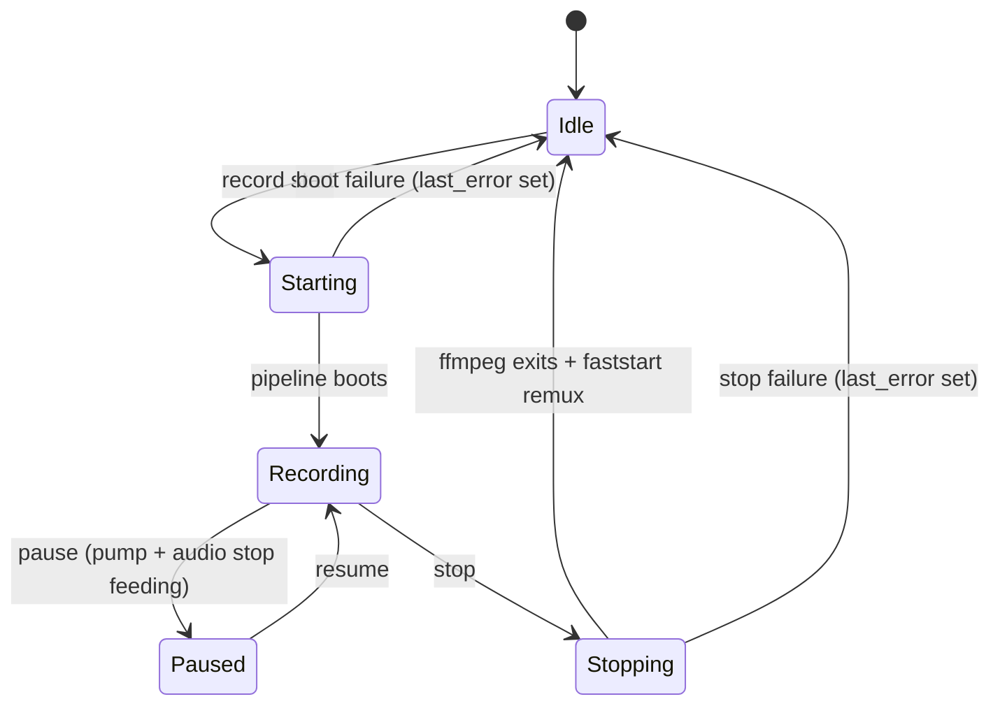

# capto-core

Active contributors: elwina

## Purpose

`crates/capto-core/` is the orchestration heart of Capto. It owns the single machine-wide `RecordingSession`, the persisted settings model, the FFmpeg argv builder, the feature-flag registry, and the local-only observability primitives (metrics and breadcrumbs) that feed crash reports. Sibling crates do the low-level work: capture (`crates/capto-capture/`), audio (`crates/capto-audio/`), and encoding (`crates/capto-encode/`). capto-core decides what to record, how to encode it, and where to write the output, then drives those crates to make it happen.

## Directory layout

| Path | Role |
|------|------|
| `crates/capto-core/src/session.rs` | `RecordingSession`, `SessionSnapshot`, `SessionState`, pipeline boot and teardown |
| `crates/capto-core/src/settings.rs` | `AppSettings` model, defaults, load/save, hotkey migration |
| `crates/capto-core/src/ffmpeg_args.rs` | `RecordRequest`, `Region`, `build_record_args`, frame sizing |
| `crates/capto-core/src/flags.rs` | Declarative feature-flag registry and `is_enabled` resolution |
| `crates/capto-core/src/breadcrumbs.rs` | In-memory ring buffer of lifecycle events for crash reports |
| `crates/capto-core/src/metrics.rs` | Local `Metrics` registry (counters, durations, usage) |
| `crates/capto-core/src/lib.rs` | `CoreError`, `Result` alias, re-exports |

## Key abstractions

| Abstraction | File | What it is |
|-------------|------|------------|
| `RecordingSession` | `crates/capto-core/src/session.rs` | The session owner: settings, capture backend, discovered encoder, and the live recording behind a `tokio::sync::Mutex`. Exposes `start`, `pause`, `resume`, `stop`, `snapshot`, `take_screenshot`, `make_output_path`. |
| `SessionSnapshot` | `crates/capto-core/src/session.rs` | The single status type (`{ state, elapsedMs, outputPath, lastError, encoder, hideApp }`, camelCase) emitted to React, the CLI, and the control plane. |
| `SessionState` | `crates/capto-core/src/session.rs` | Enum of the five session states: `Idle`, `Starting`, `Recording`, `Paused`, `Stopping`. |
| `CoreError` | `crates/capto-core/src/lib.rs` | `thiserror` enum that wraps `Capture`/`Encode`/`Audio` errors with `#[from]` and adds `InvalidState`, `Io`, and `Message`; alias `Result<T>`. |
| `AppSettings` | `crates/capto-core/src/settings.rs` | The persisted settings model with serde defaults; loaded from and saved to the Capto config directory. |
| `RecordRequest` / `Region` | `crates/capto-core/src/ffmpeg_args.rs` | The intent payload for one recording (source kind, geometry, devices, volumes, encoder, format, fps, quality, overlays, output path). `RecordRequest::from_settings` builds a default request. `Region` is a physical `x/y/width/height` rect, also used to restore the last picked region. |
| `OutputFormat` / `VideoSourceKind` | `crates/capto-core/src/settings.rs` | `Mp4`/`Gif`/`AudioOnly` and `Display`/`Window`/`Region`, shared with `crates/capto-ipc/`. |
| `FeatureFlag` / `flags::is_enabled` | `crates/capto-core/src/flags.rs` | Registry of documented toggles with declared defaults; resolution is `disabledFlags` beats `enabledFlags` beats default. |
| `Metrics` | `crates/capto-core/src/metrics.rs` | Thread-safe collector for counters, request durations, and product-usage events; `snapshot` feeds `GET /v1/metrics`. |
| `breadcrumbs::record` | `crates/capto-core/src/breadcrumbs.rs` | Process-wide ring buffer (64 events) of scrubbed lifecycle, session, control-plane, and hotkey events; `try_current_context` hands the trail to the crash-report panic hook. |

## How it works

### Session state machine

The five states in `crates/capto-core/src/session.rs` and the transitions between them:

State is derived rather than stored: `snapshot()` reports `Idle` when nothing is live, and `Recording` versus `Paused` based on whether a pause is in progress. `Starting` and `Stopping` are the in-flight phases while the async `start` and `stop` calls are awaiting; the desktop shell treats `Recording | Paused | Starting` as "busy" when guarding commands such as shutdown (see `apps/desktop/src-tauri/src/lib.rs`). Any failure funnels into `last_error`, which travels on the next `SessionSnapshot` and resets to `None` on a successful start.

### Start pipeline

`RecordingSession::start` in `crates/capto-core/src/session.rs`:

1. Guard: reject with `InvalidState("already recording")` if a recording is live.
2. Resolve geometry into a physical screen region. Window capture resolves the HWND via `capto_capture::window_by_id`; display capture prefers physical monitor rects from `capto_capture::list_monitor_rects` (xcap DIP sizes disagree under mixed DPI), then falls back to `normalize_display_rect`, which maps the xcap rect onto the nearest monitor. The region is finally clamped to the virtual screen and rejected if it falls outside it.
3. Pick the encoder: `Gif` uses the GIF encoder; otherwise `RecordRequest.encoder`, then `settings.preferred_encoder`, then `FfmpegEncoder::pick_best_h264` (NVENC to QSV to AMF to libx264) from `crates/capto-encode/`.
4. `boot_pipeline` warms the webcam first (Media Foundation) so PiP frames exist from frame 0, prepares the WASAPI audio session (`capto_audio::NativeAudioSession::prepare`), spawns FFmpeg with argv from `build_record_args`, attaches a `DxgiRecordPump` that pushes rawvideo frames over `pipe:0` on a Tokio channel, starts audio, and runs `ffmpeg.check_started`. Producers start before the health check, so the elapsed clock in the UI matches the encode timeline.
5. Encoder fallback: if boot fails for MP4 with any non-libx264 encoder, the pipeline retries once with `Libx264`; if the fallback also fails, `last_error` is set and the error surfaces.

`build_record_args` in `crates/capto-core/src/ffmpeg_args.rs` is the single place FFmpeg argv is constructed: `rawvideo` input on `pipe:0`, live PCM inputs with `-analyzeduration 0` and `-probesize 32` (default probes offset mic and loopback clocks), `amix` with `normalize=0` when both devices are present, AAC 192k audio, and `+frag_keyframe+empty_moov+default_base_moof` for MP4 so a killed FFmpeg still leaves something playable. Quality (1..100) maps to CRF via `quality_to_crf` (51 minus a linear term, clamped 18..51), and GIF output caps fps at 15 with a palettegen/paletteuse graph. `record_frame_size` rounds the region to even dimensions.

### Pause and resume

`pause` sets `DxgiRecordPump::set_paused(true)` and `NativeAudioSession::set_paused(true)` and stamps `pause_started`. Because the pump and PCM writers stop feeding stdin, the FFmpeg encode timeline simply skips paused wall time and no gap opens up. `resume` accumulates `paused_accum_ms` and un-pauses both producers. `snapshot` computes `elapsed_ms` as wall time since the encode started minus accumulated pauses minus the current pause, so the UI clock matches the output duration.

### Stop and faststart remux

`stop` in `crates/capto-core/src/session.rs` tears down in dependency order: stop the video pump first (closes the rawvideo producer), drop the webcam so preview can reopen the MF device, then stop audio. A 150 ms sleep lets the stdin writer observe the channel close and deliver EOF; any remaining stdin is dropped and FFmpeg is awaited with a 12-second timeout, killed if it does not exit. For MP4 output, `remux_frag_to_faststart` renames the fragmented file aside and runs `ffmpeg -c copy -movflags +faststart` through `FfmpegEncoder::run_once`, restoring the fragmented file if the remux fails, so common players (Movies & TV, QuickTime) open the result reliably. Finally the output file must exist and be larger than 1024 bytes; otherwise the last six non-empty lines of the rolling FFmpeg stderr tail (`stderr_log`) are joined into `last_error` so a failed recording is explainable.

### Settings persistence and hotkey migration

`AppSettings::load` in `crates/capto-core/src/settings.rs` reads `{config_dir}/Capto/settings.json` (`dirs::config_dir`) and falls back to defaults; `save` writes pretty JSON, and `load_from`/`save_to` accept explicit paths for tests and the CLI. Both `load` and `save` run `normalize_hotkeys` from `crates/capto-hooks/`, which migrates the legacy `CommandOrControl+Shift+R`-style bindings to the `Alt+F5`/`F6`/`F7`/`F8` cluster. Defaults: output directory `Videos\Capto` (`dirs::video_dir`), `mp4`, 30 fps, quality 60, cursor included, mic and loopback volume 100, source `display`, hide-app and minimize-to-tray on, locale `en`. `ensure_output_dir` creates the output folder on demand. `Option`-typed fields such as `micDevice`, `loopbackDevice`, and `preferredEncoder` use `#[serde(default)]` so older files load cleanly.

### Output naming

`RecordingSession::make_output_path` builds `capto-YYYYMMDD-HHMMSS-<8-hex>.mp4|gif|m4a` from a local timestamp and the first 8 characters of a v4 UUID; `default_screenshot_path` produces `capto-shot-<stamp>-<8-hex>.png`. Screenshots go through `take_screenshot`, which captures a frame via the `CaptureBackend` and saves it with `Frame::save_png` (see `crates/capto-capture/src/lib.rs`).

### Feature flags

The flag registry lives in `crates/capto-core/src/flags.rs` and mirrors `docs/feature-flags.md`. Flags are local by design (read from `enabledFlags`/`disabledFlags` in settings, never a remote service). Two flags exist today: `control-plane-metrics` (default on, serves `GET /v1/metrics` on localhost with auth) and `crash-reporting` (default on, writes `crash-*.json` on panic). `is_enabled` resolves `disabledFlags` first, then `enabledFlags`, then the declared default; unknown names resolve to `false`. `scripts/scan-dead-flags.ps1` fails CI when a declared flag is never referenced by runtime code.

### Metrics and breadcrumbs

`Metrics` in `crates/capto-core/src/metrics.rs` is a cheap-to-clone collector (`Arc<Mutex<>>`) with counters (`incr`/`add`), duration series (`observe_ms`, aggregated to count/total/avg/max), and product-usage events (`incr_usage`). Everything stays on the machine; the control-plane layer records endpoint counters and serves the same snapshot back at `/v1/metrics` (gated by `control-plane-metrics`). `BreadcrumbBus` in `crates/capto-core/src/breadcrumbs.rs` keeps a 64-event ring buffer of scrubbed events (categories `lifecycle`, `control-plane`, `session`, `hotkey`) with relative and wall-clock timestamps and an optional correlating `x-request-id`. The panic hook reads it through `try_snapshot`, which never blocks on a contended lock, and embeds the trail (plus uptime and last request id) into the local `crash-*.json` report. Messages are scrubbed by construction; `crates/capto-ipc/src/redact.rs` masks anything that slips in.

## Integration points

- `apps/desktop/src-tauri/src/session_svc.rs` is the main caller: Tauri commands and control-plane handlers translate IPC request types into `RecordingSession` calls, persist settings, and create output paths. The desktop shell owns the one `RecordingSession` per machine.
- Types flow outward: `crates/capto-ipc/src/types.rs` consumes `OutputFormat`, `Region`, and `VideoSourceKind` from capto-core, and its `RecordStartRequest` mirrors the fields the CLI sends over the control plane.
- `crates/capto-cli/` never creates a second `RecordingSession`; it drives the desktop's session through the control plane described in [Control-plane API](../api/index.md).
- `OverlayConfig` from `crates/capto-overlay/` is embedded in both `AppSettings.overlays` and `RecordRequest.overlays`; webcam PiP is composited in-process during `boot_pipeline`, so FFmpeg never opens dshow for it.
- Feature flags gate observable features outside the crate: `control-plane-metrics` gates `/v1/metrics` and `crash-reporting` gates crash-report writes in the desktop shell.

## Entry points for modification

- Add a session state: extend the `SessionState` enum and the transition logic in `crates/capto-core/src/session.rs` (`start`/`pause`/`resume`/`stop`, plus the derived state in `snapshot`), then update consumers such as `apps/desktop/src-tauri/src/session_svc.rs` and the UI state rendering.
- Add a feature flag: declare the const plus a `FeatureFlag` in `crates/capto-core/src/flags.rs`, gate the runtime behavior, and document it in `docs/feature-flags.md`; the flag must be referenced by runtime code or `scripts/scan-dead-flags.ps1` fails CI.
- Add a settings key: add the field (with serde defaults where optional) in `crates/capto-core/src/settings.rs`, mirror it in `docs/settings-schema.json`, and surface it in the settings UI; existing files must keep loading, so new fields need `#[serde(default)]`.
- Tune FFmpeg behavior: edit `build_record_args` and the quality/volume mapping in `crates/capto-core/src/ffmpeg_args.rs`.

## Key source files

| File | Role |
|------|------|
| `crates/capto-core/src/session.rs` | `RecordingSession`, state machine, pipeline boot/teardown, output naming |
| `crates/capto-core/src/settings.rs` | `AppSettings` model, defaults, load/save, hotkey migration |
| `crates/capto-core/src/ffmpeg_args.rs` | `RecordRequest`, `Region`, FFmpeg argv construction, frame sizing |
| `crates/capto-core/src/flags.rs` | Feature-flag registry and resolution |
| `crates/capto-core/src/breadcrumbs.rs` | Breadcrumb ring buffer for crash reports |
| `crates/capto-core/src/metrics.rs` | Local metrics registry |
| `crates/capto-core/src/lib.rs` | `CoreError`, `Result`, re-exports |
