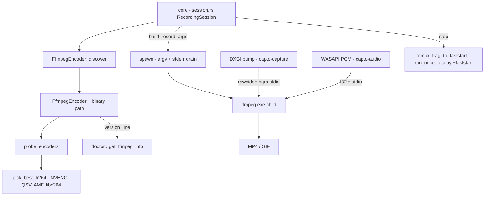

# capto-encode

Active contributors: elwina

## Purpose

`crates/capto-encode` is the single place Capto talks to FFmpeg. It owns sidecar discovery, encoder probing and selection, process spawn with stderr capture, short-run remux, and version reporting. This is a hard non-negotiable from [AGENTS.md](../../AGENTS.md): encoding happens only through this crate; UI crates never spawn FFmpeg ad hoc. Equally important, discovery resolves only the bundled sidecar, never a system/PATH FFmpeg, so the shipped binary is always the one that gets used.

## Directory layout

| File | Role |
|------|------|
| `crates/capto-encode/src/lib.rs` | The whole crate: `FfmpegEncoder`, `VideoEncoderKind`, `EncodeError`, argv builders, version and dshow parsing helpers |
| `crates/capto-encode/examples/find_ffmpeg.rs` | Small demo that resolves the sidecar from the repo layout (`apps/desktop/src-tauri/binaries`) |

## Key abstractions

| Abstraction | Where | What it does |
|-------------|-------|--------------|
| `FfmpegEncoder` | `crates/capto-encode/src/lib.rs` | Handle on a discovered bundled binary: `discover`, `resolve_binary`, `dir_has_ffmpeg`, `probe_encoders`, `pick_best_h264`, `ranked_h264`, `spawn`, `spawn_checked`, `run_once`, `version_line`, `list_dshow_video_devices` |
| `VideoEncoderKind` | `crates/capto-encode/src/lib.rs` | Enum over `H264Nvenc`, `H264Qsv`, `H264Amf`, `Libx264`, `HevcNvenc`, `HevcQsv`, `HevcAmf`, `Libx265`, `Gif`, with `ffmpeg_name()` and `is_hardware()` |
| `EncoderInfo` | `crates/capto-encode/src/lib.rs` | Probe result: `{ kind, name, available, hardware }`, serialized camelCase for the UI and control plane |
| `EncodeError` | `crates/capto-encode/src/lib.rs` | `FfmpegNotFound` (with a hint to run `scripts/download-ffmpeg.ps1` or reinstall), `FfmpegFailed`, `Io` |
| `video_encoder_args` | `crates/capto-encode/src/lib.rs` | Per-kind encoder argv: libx264 veryfast + CRF, NVENC p4/vbr/CQ, QSV global_quality + look_ahead, AMF balanced/CQP, GIF, all with `yuv420p` |
| `parse_ffmpeg_version_line` / `parse_ffmpeg_version_token` | `crates/capto-encode/src/lib.rs` | Extract the first `ffmpeg version ...` line and its short token (`7.1`, `n9.0-capto`) |
| `parse_dshow_video_devices` / `resolve_dshow_video_name` | `crates/capto-encode/src/lib.rs` | Parse `-list_devices` stderr into video device names and pick exact, prefix, or fuzzy matches |

## How it works

### Sidecar discovery (bundled only, never system PATH)

`FfmpegEncoder::discover(sidecar_dir)` calls `resolve_binary`, which only looks inside the given directory via `find_ffmpeg_in_dir` and returns `None` when the directory is missing. There is no PATH lookup anywhere, and the unit test `resolve_binary_ignores_path_without_sidecar` pins that behavior. Inside the directory, `find_ffmpeg_in_dir` prefers a plain `ffmpeg.exe` / `ffmpeg` (the dev layout), then falls back to sorted Tauri triple-suffixed names such as `ffmpeg-x86_64-pc-windows-msvc.exe`. `dir_has_ffmpeg` is the cheap existence check the desktop uses to select the sidecar directory at startup. Two Windows details matter: `normalize_spawn_path` strips `\\?\` verbatim prefixes so `CreateProcess` works from a GUI app, and `apply_no_window` sets `CREATE_NO_WINDOW` so the console-subsystem ffmpeg does not pop a console window when spawned by the Tauri app.

### Probing and encoder pick

`probe_encoders` runs `ffmpeg -hide_banner -encoders` and scans stdout plus stderr (FFmpeg has printed the list on both over the years) for each encoder name, producing `Vec<EncoderInfo>`. `pick_best_h264` then prefers `NVENC` to `QSV` to `AMF` to `libx264`; the doc comment explains the ordering: soft x264 cannot keep realtime at 1440p+ with a webcam PiP. `ranked_h264` returns only the available hardware encoders in priority order for callers that want choices.

### Spawn, stderr capture, health check

`spawn` runs the command with piped stdin, null stdout, piped stderr, and `kill_on_drop`, then spawns a Tokio task that drains stderr into an `Arc<Mutex<String>>` log that trims itself to the last ~6 KB whenever it exceeds ~12 KB, so a later crash can still be diagnosed. It returns `(Child, stderr_log)`. `spawn_checked` / `check_started` poll `try_wait` for up to 2.5 seconds and, if FFmpeg exits immediately, produce a summarized stderr plus actionable hints (prefer libx264, disable mic and system audio, fully quit Capto including the tray). `attach_dxgi_pump` in `crates/capto-core/src/session.rs` splits this deliberately: it spawns, attaches the native producers, and then runs `check_started` so WASAPI can connect before the health check.

`run_once` is the fire-and-forget variant: stdin is closed immediately and the command runs to completion. `crates/capto-core/src/session.rs` uses it for the end-of-recording remux.

### Version reporting

`version_line` runs `ffmpeg -version`, reads stdout (falling back to stderr), and keeps the first line that starts with `ffmpeg version`. `parse_ffmpeg_version_token` returns the short token after it; the tests show it tolerates Capto-branded builds whose token is `n9.0-capto` (built with `--extra-version=capto`). The doctor endpoint probes this to distinguish a real binary from one that fails to spawn.

### dshow device listing

These helpers exist for device pickers: `list_dshow_video_devices` parses `ffmpeg -f dshow -list_devices -i dummy` stderr into `"Name" (video)` entries, and `resolve_dshow_video_name` picks an exact label, a prefix/contains match (browser labels often look like `Integrated Camera (00:11:22:...)`), or the first device. This is ancillary to the main encode path, which is why the recording pipeline itself uses MF for the webcam and plain f32le PCM for mic/loopback.

## Where ffmpeg.exe lives

The sidecar ships next to the app as `apps/desktop/src-tauri/binaries/ffmpeg-<target-triple>.exe` via Tauri `externalBin`; the same folder also holds a plain `ffmpeg.exe` for `tauri dev` (see `apps/desktop/src-tauri/binaries/README.md`). It is pinned, not floating:

- `.github/capto-ffmpeg.env` fixes `CAPTO_FFMPEG_REPO=elwina/capto-ffmpeg` and `CAPTO_FFMPEG_TAG=v1.0.0-n9.0`.
- `scripts/download-ffmpeg.ps1` downloads the release asset, verifies it against the `SHA256SUMS` entry with `Get-FileHash`, and optionally verifies the GitHub attestation (`gh attestation verify`) when `CAPTO_FFMPEG_VERIFY_ATTESTATION=1`; it writes a `capto-ffmpeg.json` provenance file (including the SHA-256) next to the binary.
- The desktop surfaces the provenance: `get_ffmpeg_info` in `apps/desktop/src-tauri/src/lib.rs` embeds `.github/capto-ffmpeg.env` via `include_str!` and reads the nearby `capto-ffmpeg.json`.
- CI Release runs `scripts/download-ffmpeg.ps1` per target before packaging (see [deployment](../deployment.md) and `docs/CI.md`).

## Integration

- `boot_pipeline` in `crates/capto-core/src/session.rs` is the main path: it discovers the encoder, resolves the kind (GIF requests are always `Gif`; otherwise explicit request, then `settings.preferred_encoder`, then `pick_best_h264`), builds argv in `crates/capto-core/src/ffmpeg_args.rs` (which calls `FfmpegEncoder::video_encoder_args`), and spawns. If a hardware encoder fails to boot, MP4 recording falls back to libx264 (see `crates/capto-core/src/session.rs`).
- The DXGI pump from `crates/capto-capture` feeds `rawvideo` (bgra) into the same child's stdin, and `crates/capto-audio` feeds f32le PCM; see [capto-capture](capto-capture.md) and [capto-audio](capto-audio.md).
- On stop, `remux_frag_to_faststart` in `crates/capto-core/src/session.rs` renames the fragmented recording aside, runs `run_once` with `-c copy -movflags +faststart`, and restores the fragmented file if the remux fails.
- `list_encoders` surfaces `probe_encoders` output through the Tauri command and the `GET /v1/list/encoders` control-plane endpoint, which `capto list encoders` calls (see `apps/desktop/src-tauri/src/session_svc.rs` and `apps/desktop/src-tauri/src/lib.rs`).
- `doctor` reports `ffmpeg_ok` (a live `version_line` probe), `ffmpeg_path`, and the pinned repo/tag metadata through `GET /v1/doctor` (see `apps/desktop/src-tauri/src/session_svc.rs`), which is what `capto doctor` shows.

For the user-visible pipeline that this crate encodes, see [recording](../features/recording.md).

## Entry points for modification

- **Encoder selection and argv**: extend `VideoEncoderKind`, `pick_best_h264` / `ranked_h264`, and `video_encoder_args` in `crates/capto-encode/src/lib.rs`.
- **Spawn diagnostics**: `spawn_checked` / `check_started` and `summarize_ffmpeg_stderr` in `crates/capto-encode/src/lib.rs`.
- **Bump the sidecar**: edit `.github/capto-ffmpeg.env` (repo and tag) and rerun `scripts/download-ffmpeg.ps1` so the hash and provenance are regenerated.

## Key source files

| File | What to look for |
|------|------------------|
| `crates/capto-encode/src/lib.rs` | `FfmpegEncoder` (discovery, probe, spawn, run_once, version), `VideoEncoderKind`, `video_encoder_args`, dshow/version parsers, unit tests |
| `crates/capto-encode/examples/find_ffmpeg.rs` | Sidecar resolution demo walking the repo layout |
| `crates/capto-core/src/ffmpeg_args.rs` | Full record argv construction on top of `video_encoder_args` |
| `crates/capto-core/src/session.rs` | `boot_pipeline`, encoder fallback, `remux_frag_to_faststart` |
| `.github/capto-ffmpeg.env` | Pinned sidecar repo and tag |
| `scripts/download-ffmpeg.ps1` | Download, SHA-256 verification, attestation, provenance write |
