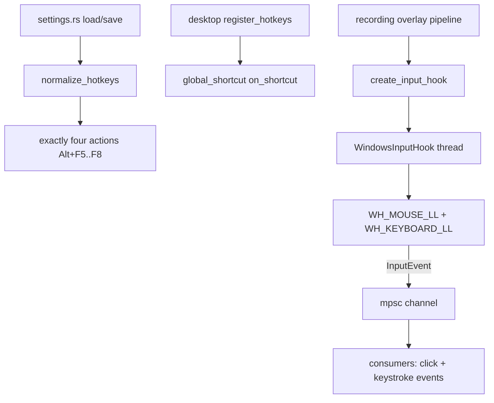

# capto-hooks

Active contributors: elwina

## Purpose

`crates/capto-hooks` covers two related concerns. First, it is the hotkey model: the actions, bindings, defaults, and the migration that keeps old keyboard settings current. Second, it provides the low-level OS input hooks that feed click and keystroke overlays while a recording runs. On Windows it installs `WH_MOUSE_LL` and `WH_KEYBOARD_LL` hooks on a dedicated thread; on other platforms it is a `NullInputHook` that does nothing, so the rest of Capto still compiles and runs.

## Directory layout

| File | Role |
|------|------|
| `crates/capto-hooks/src/lib.rs` | Shared hotkey model, `InputEvent` / `InputHook` trait, `channel`, `create_input_hook`, and the Windows LL-hook implementation in a nested `windows_impl` module |

## Key abstractions

| Abstraction | Where | What it does |
|-------------|-------|--------------|
| `HotkeyAction` | `crates/capto-hooks/src/lib.rs` | `StartRecording`, `PauseRecording`, `StopRecording`, `TakeScreenshot` |
| `HotkeyBinding` | `crates/capto-hooks/src/lib.rs` | `action` + `shortcut` (Tauri string, e.g. `CommandOrControl+Shift+R`) + `enabled` |
| `InputHook` | `crates/capto-hooks/src/lib.rs` | Trait with `start(Sender<InputEvent>)` and `stop()` that overlay consumers treat as opaque |
| `InputEvent` | `crates/capto-hooks/src/lib.rs` | `MouseButton { button, x, y, down }` or `Key { label, down }` |
| `WindowsInputHook` | `crates/capto-hooks/src/lib.rs` | LL mouse/keyboard hooks on a named `capto-input-hooks` thread |
| `NullInputHook` | `crates/capto-hooks/src/lib.rs` | No-op on non-Windows; `start` returns `Ok` and `stop` does nothing |
| `default_hotkeys` | `crates/capto-hooks/src/lib.rs` | `Alt+F5`..`Alt+F8` for the four actions (`Alt+F4` is reserved by Windows) |
| `normalize_hotkeys` | `crates/capto-hooks/src/lib.rs` | Migrates legacy `Ctrl+Shift` defaults and reorders to exactly the four supported actions |
| `create_input_hook` | `crates/capto-hooks/src/lib.rs` | Factory returning `WindowsInputHook` on Windows, `NullInputHook` elsewhere |
| `channel` | `crates/capto-hooks/src/lib.rs` | Convenience `mpsc::channel()` for `InputEvent` |

## How it works

### Hotkey normalization

`normalize_hotkeys` runs on settings load/save. It first migrates values that still equal the pre-1.0 defaults (`Ctrl+Shift+R/P/E/S`) to the current `Alt+F5`..`Alt+F8` cluster, then rebuilds the vector from `default_hotkeys()` so settings always expose exactly the four supported actions in order, filling in any missing binding from the defaults. The desktop's `register_hotkeys` (see `apps/desktop/src-tauri/src/lib.rs`) clones `settings.hotkeys`, calls `normalize_hotkeys`, unregisters all global shortcuts, and re-registers an `on_shortcut` handler per enabled binding that dispatches to the matching start/pause/stop/screenshot command.

### LL hook thread

`WindowsInputHook::start` stores the sender in a shared `TX`, initializes the `KEYS_DOWN` set, and spawns a thread. That thread sets per-monitor DPI awareness, installs `WH_MOUSE_LL` and `WH_KEYBOARD_LL` via `SetWindowsHookExW` (recording each handle in a mutex for later `UnhookWindowsHookEx`), and runs a standard `GetMessageW`/`TranslateMessage`/`DispatchMessageW` loop; after the loop it unhooks both.

- **Mouse proc**: emits `InputEvent::MouseButton` for `WM_LBUTTONDOWN`, `WM_RBUTTONDOWN`, `WM_MBUTTONDOWN` with the cursor point, `down: true`.
- **Keyboard proc**: for `WM_(SYS)KEYDOWN`/`WM_(SYS)KEYUP`, modifier virtual keys are skipped (they only matter as chord prefixes), and a key down is only emitted if it is the first of a hold. The `KEYS_DOWN` set tracks held virtual keys so OS auto-repeat `KEYDOWN`s are deduped; a `keyup` removes the key. `format_key_label` builds a chord like `Ctrl+A` from the currently-held `Ctrl`/`Alt`/`Shift`/`Win` keys (`GetAsyncKeyState`) plus the key name (`MapVirtualKeyW` to scan code, then `GetKeyNameTextW`), skips `Ctrl+Control`-style duplicates, and falls back to a hex code when a name cannot be resolved.

`stop()` posts `WM_QUIT` to the thread, joins it, clears the sender and `KEYS_DOWN`, and unhooks. Because `stop` and the running loop are all behind `Send`-safe mutexes, the overlay pipeline can start and stop hooks per take without a leak.

## Integration

- `register_hotkeys` in `apps/desktop/src-tauri/src/lib.rs` runs `normalize_hotkeys` and wires the four global shortcuts to their recording commands; settings persistence is in `apps/desktop/src-tauri/src/settings.rs`.
- Recordings create the input hook through `create_input_hook()` and route `InputEvent`s into the click and keystroke overlay renderers, which appear in the video (see [overlays](../features/overlays.md) and [recording](../features/recording.md)).
- Hotkey defaults and conflict rules are documented for users in [hotkeys](../features/hotkeys.md); the settings model that stores bindings lives in `crates/capto-core` (see [capto-core](capto-core.md)).

## Entry points for modification

- **Add or reorder a hotkey action**: `HotkeyAction`, `default_hotkeys`, and `normalize_hotkeys` (including the `LEGACY` migration table) in `crates/capto-hooks/src/lib.rs`.
- **New input event or extra metadata**: extend `InputEvent` and the corresponding reactor in the consumer.
- **Hook mechanics**: `mouse_proc`, `keyboard_proc`, `format_key_label`, and the thread setup in `crates/capto-hooks/src/lib.rs`.
- **Non-Windows path**: implement a real `InputHook` behind `#[cfg(not(windows))]` in `crates/capto-hooks/src/lib.rs` (currently `NullInputHook`).

## Key source files

| File | What to look for |
|------|------------------|
| `crates/capto-hooks/src/lib.rs` | `HotkeyAction`/`HotkeyBinding`, `default_hotkeys`, `normalize_hotkeys`, `InputEvent`/`InputHook`, `WindowsInputHook` LL hooks and key-label formatting, `NullInputHook`, `create_input_hook` |
| `apps/desktop/src-tauri/src/lib.rs` | `register_hotkeys`, global-shortcut wiring |
| `apps/desktop/src-tauri/src/settings.rs` | Hotkey bindings in `AppSettings`, load/save through `normalize_hotkeys` |
