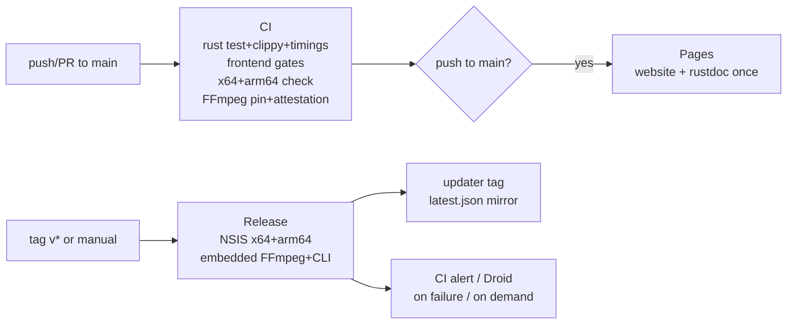

# Deployment

Active contributors: elwina

Capto ships as a Windows desktop app plus a landing site and API docs, all driven by GitHub Actions. CI and Release are deliberately separate: a green CI run only proves the tree builds and passes checks, it never publishes anything. Only a tagged Release produces installers, and only a push to `main` updates the site + docs. This page walks the pipelines, versioning, installer layout, FFmpeg supply chain, hosting, the in-app updater flow, and the release checklist. The canonical source is `docs/CI.md`; this page condenses it and maps the pieces to repo paths.

## Workflows

| Workflow | File | Trigger | What it does |
|----------|------|---------|--------------|
| **CI** | `.github/workflows/ci.yml` | push / PR to `main` | Rust `fmt` + `test --workspace` + `clippy` (warn-only) + `cargo build --timings` (report uploaded as an artifact); frontend `tsc` + lint + format + jscpd + knip + `bundle-size` gate + real Vite `build`; `cargo check` for **x64 + arm64**; FFmpeg pin download with attestation; repo-hygiene and PII scans; agent package dry-runs; devcontainer build + smoke. |
| **Release** | `.github/workflows/release.yml` | tag `v*` or manual | NSIS installers for x64 + arm64 with **embedded** FFmpeg + CLI (`cli\capto.exe`); signed updater artifacts; mirrors `latest.json` onto a rolling `updater` tag; appends an auto-generated commit changelog. |
| **Pages** | `.github/workflows/pages.yml` | push to `main` or manual | Deploys **one** GitHub Pages artifact: `website/` at the site root and workspace rustdoc under `/docs/`. This is the only workflow allowed to write the `github-pages` environment. |
| **Droid review** | `.github/workflows/droid.yml` + `.github/workflows/droid-review.yml` | `@droid` mentions / PRs | Factory Droid AI code + security review. Requires the `FACTORY_API_KEY` secret; **not** a required check, a missing key only skips these jobs. |
| **CI alert** | `.github/workflows/ci-alert.yml` | `workflow_run` on CI/Release/Pages completion | On a required workflow failure, opens (or bumps) a `[build-health]` GitHub issue with the failing run URL, turns red CI into tracked work with no external service. |
| **CodeQL** | `.github/workflows/codeql.yml` | push/PR + weekly cron | Semantic JavaScript/TypeScript analysis (Rust support is still beta, so it is left out). |
| **Secret scan** | `.github/workflows/secret-scan.yml` | push/PR | Gitleaks over full repo history; uploads redacted SARIF to the Security tab. |

The pipeline a commit and a tag travel is:

Because the CI and Release paths are separate, a merged PR or green CI never blocks a release, and a release never surprises maintainers by running day-to-day checks.

## Versioning

- Workspace version is **1.0.0** (`Cargo.toml`). It is kept in lockstep with `apps/desktop/src-tauri/tauri.conf.json`, `scripts/check-version-drift.ps1` (run in CI hygiene) fails if the two drift.
- Git tags `v1.*` are **stable**; `v0.*` were treated as **prerelease** (`prerelease: startsWith(github.ref_name, 'v0.')` in `.github/workflows/release.yml`).
- A rolling **canary** tag supports staged rollouts before stable users get an update (see [Updates](features/updates.md)).

## Installer layout

Custom NSIS templates:

- `apps/desktop/src-tauri/windows/installer.nsi`, Tauri NSIS template fork. Fixes install to `%LOCALAPPDATA%\Capto` (no directory chooser, per-user / `currentUser` install mode) and keeps CLI/FFmpeg paths stable.
- `apps/desktop/src-tauri/windows/hooks.nsh`, wired via `tauri.conf.json` → `bundle.windows.nsis.installerHooks`. Adds `$INSTDIR\cli` to the user **PATH** with the EnVar NSIS plugin (registry-based, no `NSIS_MAX_STRLEN` truncation, idempotent add, exact delete on uninstall). Only `cli\` is added, never `$INSTDIR`, so `Capto.exe` cannot shadow `capto` on case-insensitive Windows.

What ships in the installer:

- The Tauri app executable, FFmpeg sidecar via `externalBin`, resources, and the staged CLI.
- The bundled CLI lives at `<install>\cli\capto.exe` and is on PATH after install (open a new terminal and run `capto doctor`). The CLI is **not** published as a separate Release asset, see `apps/desktop/src-tauri/binaries/README.md`.
- Start-menu shortcut, optional desktop shortcut, file associations, deep links, and an uninstaller with a delete-app-data option.

There is **no MSI** and no directory chooser: install location is fixed. The CLI stage step is `cargo build -p capto-cli --release` + `scripts/copy-cli.ps1`.

## FFmpeg pin

The encoder sidecar never comes from system PATH. It is downloaded only from `elwina/capto-ffmpeg` Releases, pinned in `.github/capto-ffmpeg.env` (currently `CAPTO_FFMPEG_REPO=elwina/capto-ffmpeg`, `CAPTO_FFMPEG_TAG=v1.0.0-n9.0`).

- `scripts/download-ffmpeg.ps1` selects the asset by Rust target triple, verifies **SHA-256** against the release `SHA256SUMS`, and (in CI/Release) runs **`gh attestation verify`** (Sigstore / Artifact Attestations) when `-VerifyAttestation` is passed.
- It copies `ffmpeg-windows-x86_64.exe` / `ffmpeg-windows-aarch64.exe` to `apps/desktop/src-tauri/binaries/ffmpeg-<triple>.exe` for Tauri `externalBin`, and writes a `capto-ffmpeg.json` metadata file.
- `apps/desktop/src-tauri/binaries/capto.exe` is bundled as a Tauri resource (`tauri.conf.json`), so the CI check builds and stages the CLI before `cargo check`.

Supply-chain trust is covered in [Security](security.md).

## Architectures

| Display | Rust target | Installer | Bundled CLI |
|---------|-------------|-----------|-------------|
| **x64** | `x86_64-pc-windows-msvc` | NSIS `.exe` | `<install>\cli\capto.exe` (+ user PATH) |
| **arm64** | `aarch64-pc-windows-msvc` | NSIS `.exe` | `<install>\cli\capto.exe` (+ user PATH) |

The `*-windows-msvc` strings are Rust target triples (Windows ABI); release names use x64 / arm64.

## Hosting

| Host | URL / path | Driver |
|------|------------|--------|
| GitHub Pages | `https://elwina.github.io/Capto/` (site root) + `/docs/` (rustdoc) | `.github/workflows/pages.yml` → `deploy` job (`actions/deploy-pages`) |
| Cloudflare Pages | `https://capto.elwina.work/` (primary) / `capto.pages.dev` | CF dashboard Git integration (no workflow, no API token secret) |

- **GitHub Pages** deploys one artifact containing both the static `website/` landing page (site root) and `cargo doc --workspace --no-deps --exclude capto-app` under `/docs/`. It is the *only* workflow allowed to write the `github-pages` environment (a comment in `pages.yml` explains why: two previous deployers were silently overwriting each other).
- **Cloudflare Pages** is dual-active for the same `website/`. Because this is a monorepo, the CF project's **Root directory** must be set to `website` (otherwise CF deploys the whole repo as a static site). The custom domain CNAME (`capto.elwina.work` → `capto.pages.dev`) must be added in Tencent Cloud DNS where `elwina.work` lives.

## Updater flow

The in-app updater reads `latest.json` from endpoints in order (see [Updates](features/updates.md)):

1. Cloudflare Worker mirror, `https://capto-update-proxy.elwina-vardal.workers.dev/updates/latest.json` (worker-first; free CDN edge, avoids `api.github.com` rate limits; see [Updater mirror](apps/updater-mirror.md)).
2. GitHub, `https://github.com/elwina/Capto/releases/download/updater/latest.json`.

Each Release signs `latest.json` with minisign (`TAURI_SIGNING_PRIVATE_KEY` secret), and the `publish-updater-manifest` job mirrors it onto a rolling `updater` tag so the check URL never changes. For staged rollouts, publish to a `canary` tag, validate, then promote the same `latest.json` to `updater`.

## Releasing checklist

1. Run the hygiene gates: `scripts/scan-tech-debt.ps1`, `scripts/check-file-size.ps1`, `scripts/check-version-drift.ps1`, `scripts/scan-dead-flags.ps1`.
2. Run the full test suites: `cargo test --workspace` and `npm test --prefix apps/desktop`.
3. Bump the version **in lockstep**: `Cargo.toml` workspace + `apps/desktop/src-tauri/tauri.conf.json` + `package.json`.
4. Tag `v*` (`v1.x` = stable); push the tag.
5. `.github/workflows/release.yml` builds both NSIS installers, mirrors `latest.json` to the `updater` tag, and appends the changelog.
6. Verify the installers on a Windows box: install, confirm `<install>\cli\capto.exe` is on PATH in a new terminal, and exercise the update path.
7. If a canary was used, promote it (publish the same `latest.json` to the `updater` tag) and remove the superseded `canary` tag.

## GitHub Actions versions

Aligned with Tauri's current pipeline docs and Node 24 runners: `actions/checkout@v7`, `actions/setup-node@v6` with `node-version: "24"`, `tauri-apps/tauri-action@v1`. Secret handling notes: `GITHUB_TOKEN` is used for attestation reads and release writes; `FACTORY_API_KEY` (Droid) and `TAURI_SIGNING_PRIVATE_KEY` / `TAURI_SIGNING_PRIVATE_KEY_PASSWORD` (updater) are Actions secrets and never committed.

## Integration points

- [Updates](features/updates.md), signing, canary, and the `updater`/`canary` tags.
- [Updater mirror](apps/updater-mirror.md), the Cloudflare Worker behind the worker-first endpoint.
- [Security](security.md), trust boundaries, the sidecar supply chain, and repo defenses referenced throughout this page.
- `docs/CI.md`, the canonical CI / release document this page summarizes.
