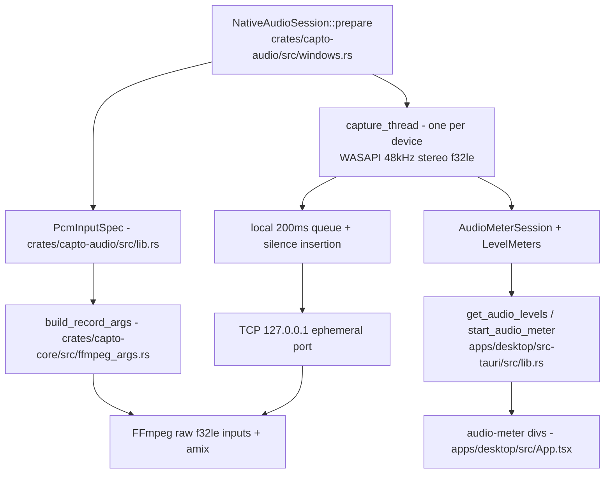

# Audio capture

Active contributors: elwina

## Purpose

Capto records sound from two sources into a take: your microphone (a WASAPI capture endpoint) and system sound (a WASAPI render endpoint opened in loopback mode). Both stream live PCM to FFmpeg over localhost TCP, and both feed a volume level meter that the UI polls before and during recording so you can check levels before hitting record. The same WASAPI machinery powers mic-only, loopback-only, and audio-only (`m4a`) recordings.

The WASAPI internals live in `crates/capto-audio/src/windows.rs`, the public types and non-Windows stubs in `crates/capto-audio/src/lib.rs`. The FFmpeg argv that consumes the PCM streams is built in `crates/capto-core/src/ffmpeg_args.rs`, and the UI metering commands are in `apps/desktop/src-tauri/src/lib.rs`.

## How it works

`NativeAudioSession::prepare` (in `crates/capto-audio/src/windows.rs`) is called for each selected device. It binds a `TcpListener` on `127.0.0.1:0`, records the ephemeral port as a `PcmInputSpec.url` (`tcp://127.0.0.1:<port>`), and returns the specs so the core can bake them into the FFmpeg command. Each capture thread then initializes a WASAPI shared-mode capture client for the endpoint, requests 48 kHz stereo float (`SampleType::Float`, 32 bits per sample), and streams 10 ms chunks.

Delivery is paced by a 10 ms tick rather than raw capture speed: `capture_thread` queues packets, inserts silence for silent packets, drains at most 200 ms of backlog, and writes one 480-frame chunk per tick over TCP. TCP keeps FFmpeg's stdin free (the `q` command still works) and gives each audio source independent backpressure without filesystem or named-pipe cleanup. When paused, the thread drops queued audio and writes nothing, so the encode timeline (like the video pump) excludes paused wall time and the sample clock stays synced to the video CFR clock.

### Why TCP instead of a named pipe

The module doc in `crates/capto-audio/src/windows.rs` explains the choice directly: TCP keeps stdin free for FFmpeg's `q` command and lets each source backpressure independently without filesystem or named-pipe cleanup. `accept_ffmpeg` waits for the single FFmpeg client; the stream is then switched to blocking with a 2 s write timeout so a brief FFmpeg stall does not kill the mic mid-take.

### FFmpeg integration

`build_record_args` in `crates/capto-core/src/ffmpeg_args.rs` adds each `PcmInputSpec` as an `f32le`, 48 kHz, stereo input with `-analyzeduration 0` and `-probesize 32`. Those shorted probes matter: letting FFmpeg run its default multi-second probe opens the live TCP inputs one after another and offsets mic and loopback clocks, making `amix` backpressure the video. When both devices are present, the graph mixes them with `amix=inputs=2:duration=shortest:dropout_transition=0:normalize=0` (no normalization, so per-channel `volume=` gains keep their meaning) and encodes AAC 192k. Audio-only output sets `-vn` and skips video entirely, giving an `m4a` file.

### Volumes

Dedicated `mic_volume` and `loopback_volume` settings (`crates/capto-core/src/settings.rs`, mirrored on `RecordRequest`) apply a `volume=` gain per source. Volume is applied just before the mix (via `audio_gain`/`append_audio_filters`) when both devices are present, or via `-af volume=` for a single source. The UI allows values up to 200 for gain above unity (`apps/desktop/src-tauri/src/session_svc.rs` clamps with `.min(200)`).

### Device selection

`list_audio_devices` (`apps/desktop/src-tauri/src/lib.rs`) calls `crates/capto-audio::list_devices`, which enumerates WASAPI endpoints on a short-lived OS thread. Capture endpoints are offered as microphones and render endpoints as loopback sources; each carries a stable `wasapi:{direction}:{id}` id and an `is_default` flag. `AudioDeviceKind` (`Input`/`Output`/`Loopback`) is checked so the wrong-direction device is rejected with a clear error.

## Pre-record metering

The UI shows live mic and system levels before recording. When the user enables a test meter, `start_audio_meter` (`apps/desktop/src-tauri/src/lib.rs`) creates a short-lived `capto_audio::AudioMeterSession` (refusing to run while recording), which spins up a `meter_thread` per device that runs the same WASAPI capture but only computes peak levels. Peaks are stored in a lock-free `LevelMeters` shared slot. `get_audio_levels` returns the live recording session's levels first (`RecordingSession::audio_levels`) and falls back to the meter session's levels while idle. `stop_audio_meter` drops the meter threads.

`AudioLevels` (`crates/capto-audio/src/lib.rs`) is a normalized 0.0..=1.0 pair, `microphone` and `system`. `apps/desktop/src/App.tsx` polls `get_audio_levels` every 100 ms while recording or audio testing and drives two `audio-meter` bar divs (`apps/desktop/src/styles/app.css`) via `audioMeterPercent`.

## Configuration options

| Option | Where | Meaning |
|--------|-------|---------|
| `micDevice` / `loopbackDevice` | `crates/capto-core/src/settings.rs` | `wasapi:...` device ids, optional |
| `mic_volume` / `loopback_volume` | `crates/capto-core/src/settings.rs` | Gain per source, >100 boosts |
| `--mic` / `--loopback` | `crates/capto-cli/src/main.rs` | CLI record flags for device selection |
| `format` `AudioOnly` (`m4a`) | `crates/capto-core/src/settings.rs`, `crates/capto-cli/src/main.rs` | Audio-only output |
| Volume test | `apps/desktop/src/App.tsx` | Start/stop the pre-record meter commands |

## Integration points

- `crates/capto-core/src/session.rs` calls `capto_audio::NativeAudioSession::prepare`, collects `inputs()`, passes them into `build_record_args`, and starts/stops/pauses the session in lock-step with the video pump.
- `apps/desktop/src-tauri/src/lib.rs` exposes `list_audio_devices`, `get_audio_levels`, `start_audio_meter`, and `stop_audio_meter`.
- `crates/capto-cli/src/main.rs` maps `--mic`/`--loopback` and the `audio`/`m4a` format into the record request the CLI sends over the control plane (`apps/desktop/src-tauri/src/lib.rs` `StartArgs`).
- See [capto-audio](../crates/capto-audio.md) for the WASAPI internals and [recording](../features/recording.md) for how audio joins the video pipeline.

## Entry points for modification

- Change the PCM transport or pacing: `capture_thread`, `write_all_pcm`, and the queue policy in `crates/capto-audio/src/windows.rs`.
- Change sample rate / channels / bit depth: `SAMPLE_RATE`, `CHANNELS`, and the `WaveFormat` in `crates/capto-audio/src/windows.rs` plus the matching `f32le` input in `crates/capto-core/src/ffmpeg_args.rs`.
- Change the mix or gain mapping: `append_audio_filters` / `audio_gain` in `crates/capto-core/src/ffmpeg_args.rs`.
- Add a new level source or smooth the meter: `LevelMeters` in `crates/capto-audio/src/windows.rs` and the polling in `apps/desktop/src/App.tsx`.

## Key source files

| File | What to look for |
|------|------------------|
| `crates/capto-audio/src/lib.rs` | `AudioDeviceKind`, `AudioDeviceInfo`, `PcmInputSpec`, `AudioLevels`, good public API |
| `crates/capto-audio/src/windows.rs` | `NativeAudioSession`, `AudioMeterSession`, `capture_thread`, `meter_thread`, `LevelMeters`, `list_devices` |
| `crates/capto-core/src/settings.rs` | `micDevice`, `loopbackDevice`, `mic_volume`, `loopback_volume` |
| `crates/capto-core/src/ffmpeg_args.rs` | PCM inputs, `append_audio_filters`, `audio_gain`, `-vn` for audio-only |
| `crates/capto-core/src/session.rs` | Audio session lifecycle in `boot_pipeline`, `pause`, `resume`, `stop`, `audio_levels` |
| `apps/desktop/src-tauri/src/lib.rs` | `list_audio_devices`, `get_audio_levels`, `start_audio_meter`, `stop_audio_meter` |
| `apps/desktop/src-tauri/src/session_svc.rs` | Volume clamping, device threading into `RecordRequest` |
| `crates/capto-cli/src/main.rs` | `--mic`, `--loopback`, `m4a`/`audio` format mapping |
| `apps/desktop/src/App.tsx` | Pre-record meter polling and `audio-meter` rendering |
