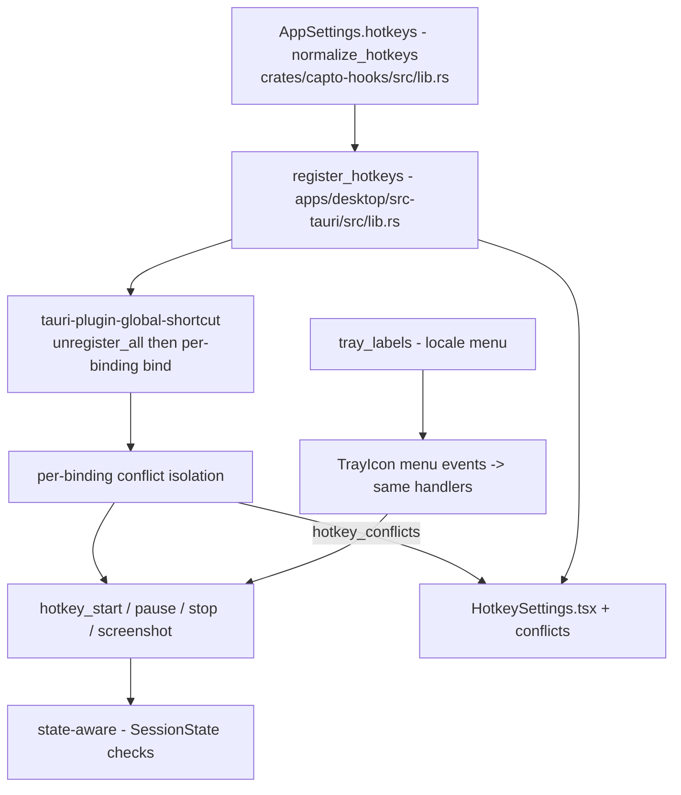

# Hotkeys

Active contributors: elwina

## Purpose

Capto controls recording from anywhere on the desktop with global shortcuts, and mirrors those same actions in the system tray menu. The default cluster is `Alt+F5` (start), `Alt+F6` (pause/resume), `Alt+F7` (stop), and `Alt+F8` (screenshot). The hotkey model and the low-level input hooks live in `crates/capto-hooks/src/lib.rs`; registration, the action handlers, and the tray come from `apps/desktop/src-tauri/src/lib.rs`; and the settings UI is `apps/desktop/src/components/HotkeySettings.tsx`.

## How it works

### Defaults and migration

`default_hotkeys()` in `crates/capto-hooks/src/lib.rs` returns the four `HotkeyBinding`s. `Alt+F4` is deliberately avoided because Windows reserves it for closing the focused window. `normalize_hotkeys` runs on every load and save: it migrates the legacy `Ctrl+Shift+<R/P/E/S>` bindings to the `Alt+F5..F8` cluster when they are still unchanged, and reorders the list so exactly the four supported actions are always present in order, filling gaps with defaults. The same normalization is applied inside `register_hotkeys` before registration.

### Registration

`register_hotkeys` (`apps/desktop/src-tauri/src/lib.rs`) takes the settings, normalizes the bindings, and calls `gs.unregister_all()` on the `tauri-plugin-global-shortcut` handle, then binds each enabled binding in turn with `gs.on_shortcut`. Each shortcut string is parsed into modifiers + key by `parse_hotkey_shortcut`. Failures are isolated per binding: if one binding cannot be registered (for example a shortcut another app holds, or one Windows briefly keeps alive after unregister), that binding is logged, pushed onto a `conflicts` vector, and registration continues with the rest. This keeps a single unavailable binding from blocking the other three.

The pressed handler records a breadcrumb and a usage metric, then dispatches to the matching action handler. `register_hotkeys` returns the conflict list, which `run()` stores in `AppState.hotkey_conflicts`.

### State-aware action handlers

Each handler is guarded by the current session state so a shortcut is a no-op outside the states it can act on:

- `hotkey_start`: from `Idle` it starts a recording with the current settings; from `Paused` it resumes. Any other state is ignored.
- `hotkey_pause`: from `Recording` it pauses; from `Paused` it resumes. Other states are ignored.
- `hotkey_stop`: stops when `Recording | Paused | Starting`.
- `hotkey_screenshot`: takes a screenshot from the stored default source, display, and region settings.

These handlers live in `apps/desktop/src-tauri/src/lib.rs` and reuse the same recording functions as the UI and control plane (`session_svc`).

### Conflicts surfaced to the UI

`get_hotkey_conflicts` (`apps/desktop/src-tauri/src/lib.rs`) returns the stored `hotkey_conflicts` list. `apps/desktop/src/components/HotkeySettings.tsx` compares each row's shortcut against that list (case- and whitespace-insensitive) and marks any unavailable binding with the `conflict` class and a `hotkeyUnavailable` hint. The settings UI also blocks obviously broken rebinds: a modifier-only or structural key, plain keys with no modifier, and `Alt+F4` are rejected, and duplicate shortcuts are refused.

### Tray menu

The system tray is built in `app.setup` with six `MenuItem`s whose labels come from `tray_labels` in `apps/desktop/src-tauri/src/lib.rs` (Show, Start, Pause/Resume, Stop, Screenshot, Quit), translated to zh-TW / zh / ja / ko / de / fr / es / pt / ru and English by `settings.locale`. Each menu event invokes the same `hotkey_start` / `hotkey_pause` / `hotkey_stop` / `hotkey_screenshot` handlers through `tauri::async_runtime::spawn`, so tray and keyboard control behave identically. A left-click on the tray icon shows and focuses the main window; `quit` shuts down the control plane and exits.

## Configuration options

| Option | Where | Meaning |
|--------|-------|---------|
| `hotkeys` | `crates/capto-core/src/settings.rs` | Persisted `Vec<HotkeyBinding>` (action, shortcut, enabled) |
| `HotkeyBinding.shortcut` | `crates/capto-hooks/src/lib.rs` | Tauri shortcut string, e.g. `Alt+F5` |
| `HotkeyBinding.enabled` | `crates/capto-hooks/src/lib.rs` | Toggle registration per action |
| `locale` | `crates/capto-core/src/settings.rs` | Picks `tray_labels` translation |
| `hide_app_while_recording`, `include_cursor`, etc. | `crates/capto-core/src/settings.rs` | Values the start handler folds into a recording |

The four actions are fixed (`HotkeyAction` in `crates/capto-hooks/src/lib.rs`: `StartRecording`, `PauseRecording`, `StopRecording`, `TakeScreenshot`). `HotkeySettings.tsx` rebuilds exactly four rows in that order, tolerating files with missing entries.

## Integration points

- `apps/desktop/src-tauri/src/lib.rs` `run()` calls `register_hotkeys` during setup and stores conflicts in `AppState`; the same file defines `parse_hotkey_shortcut`, the four handlers, and `tray_labels`.
- `apps/desktop/src-tauri/src/session_svc.rs` implements the recording functions the handlers call.
- `crates/capto-core/src/settings.rs` calls `normalize_hotkeys` on every load and save and embeds the hotkeys in `AppSettings`.
- `crates/capto-hooks/src/lib.rs` also supplies the low-level input hooks (`WH_MOUSE_LL` / `WH_KEYBOARD_LL`) used by the recording overlay; see [capto-hooks](../crates/capto-hooks.md) and [overlays](../features/overlays.md).

## Entry points for modification

- Change defaults or migration rules: `default_hotkeys` and `normalize_hotkeys` in `crates/capto-hooks/src/lib.rs`.
- Change parsing, registration, or conflict handling: `parse_hotkey_shortcut`, `register_hotkeys`, and `get_hotkey_conflicts` in `apps/desktop/src-tauri/src/lib.rs`.
- Change the per-action state guards: `hotkey_start` / `hotkey_pause` / `hotkey_stop` / `hotkey_screenshot` in `apps/desktop/src-tauri/src/lib.rs`.
- Change the tray or its translations: `tray_labels` and the tray menu wiring in `apps/desktop/src-tauri/src/lib.rs`.
- Change the settings UI or rebind rules: `apps/desktop/src/components/HotkeySettings.tsx` (`shortcutFromEvent`, `formatShortcut`, duplicate and `Alt+F4` guards).

## Testing

`apps/desktop/src/components/HotkeySettings.test.ts` exercises the settings block, and `apps/desktop/src/components/HotkeySettings.rebind.test.tsx` covers click-to-rebind flow, including rejected modifiers and blocked `Alt+F4`.

## Key source files

| File | What to look for |
|------|------------------|
| `crates/capto-hooks/src/lib.rs` | `HotkeyAction`, `HotkeyBinding`, `default_hotkeys`, `normalize_hotkeys` |
| `crates/capto-core/src/settings.rs` | `hotkeys` field, load/save + migration |
| `apps/desktop/src-tauri/src/lib.rs` | `register_hotkeys`, `parse_hotkey_shortcut`, action handlers, `get_hotkey_conflicts`, `tray_labels`, tray setup |
| `apps/desktop/src-tauri/src/session_svc.rs` | Recording functions the handlers call |
| `apps/desktop/src/components/HotkeySettings.tsx` | Settings UI, rebind capture, conflict marking |
| `apps/desktop/src/components/HotkeySettings.test.ts` | Settings block tests |
| `apps/desktop/src/components/HotkeySettings.rebind.test.tsx` | Rebind flow tests |
