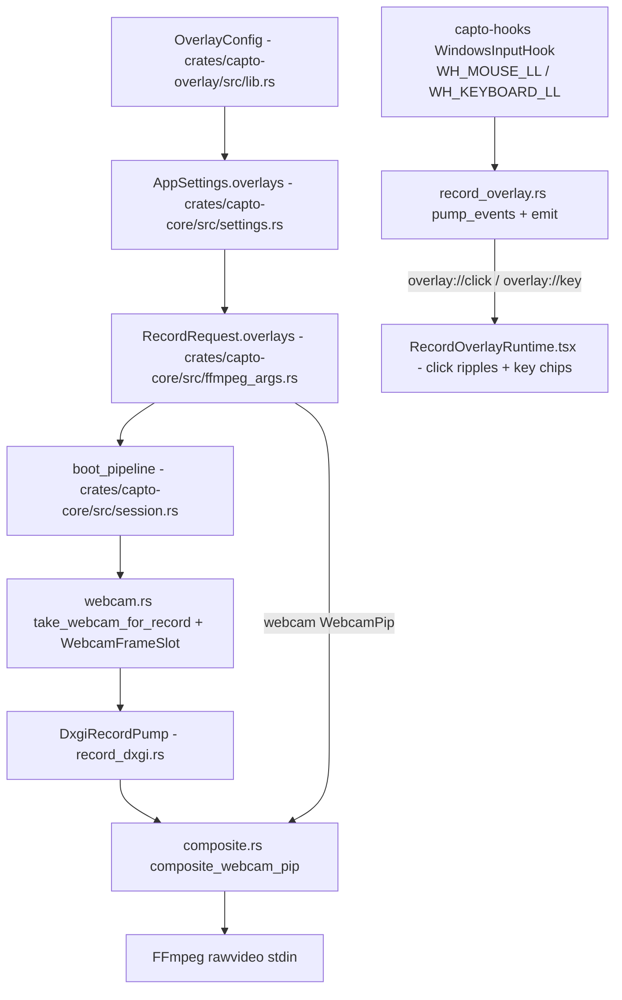

# Overlays

Active contributors: elwina

## Purpose

Capto draws several kinds of overlays: things burned into the recording file and things shown live on screen during a take. Burned-in content is the webcam picture-in-picture, which the Rust compositor stitches into every frame before it reaches the encoder. Live, in-the-moment content is the click ripples and keystroke chips rendered by a transparent click-through window on top of the capture region; it is captured only if that area is part of the shot, it is never added to the file by FFmpeg. Text, image, and elapsed overlays exist in the config model and the layout preview so the shapes and defaults are settled, but the recording burn-in for them is not yet wired in.

The overlay model lives in `crates/capto-overlay/src/lib.rs` (`OverlayConfig` and its sub-structs), is embedded in the settings blob (`crates/capto-core/src/settings.rs`) and in each `RecordRequest` (`crates/capto-core/src/ffmpeg_args.rs`), and is edited from the UI panels `apps/desktop/src/components/OverlayPanel.tsx`, `apps/desktop/src/components/OverlayPreview.tsx`, and `apps/desktop/src/components/WebcamPanel.tsx`.

## How it works

Two independent lanes: in-process compositing for burned-in content, and an input-hook event feed for live on-screen overlays.

The compositor path ends in burned-in pixels. The hook path ends in a live window that is visible beside the capture for the benefit of the camera person and the audience only if that region is recorded.

### Burned-in: webcam PiP

When `webcam.enabled` is set, `boot_pipeline` in `crates/capto-core/src/session.rs` warms the Media Foundation camera with `take_webcam_for_record` (before the encode clock starts) so PiP frames exist from frame 0. The `DxgiRecordPump` then calls `composite_webcam_pip` in `crates/capto-capture/src/composite.rs`, which blits the camera frame onto each capture frame per the `WebcamPip` layout (position, size, corner radius, mirror). Because this happens in-process before FFmpeg, FFmpeg never opens dshow. See [Webcam PiP](webcam-pip.md).

### Live on-screen: mouse click ripples

`apps/desktop/src-tauri/src/record_overlay.rs` opens one transparent, always-on-top, click-through webview window sized to the capture bounds (`OverlayBounds::from_region_or_screen`). A low-level mouse hook (`WH_MOUSE_LL` in `crates/capto-hooks/src/lib.rs`) forwards left/right/middle button-downs that land inside those bounds. `pump_events` builds a `ClickPayload` (button, position, the configured color per button, radius, id) and emits `overlay://click`. `apps/desktop/src/components/RecordOverlayRuntime.tsx` listens and renders a ripple that fades after roughly 550 ms.

### Live on-screen: keystroke overlay

The same window receives key events from the keyboard hook (`WH_KEYBOARD_LL`). `crates/capto-hooks/src/lib.rs` dedupes OS auto-repeat (only the first KEYDOWN per held key), builds a display label such as `Ctrl+C`, and emits `overlay://key`. `RecordOverlayRuntime.tsx` renders a chip (font size, foreground and background colors from the config) and replaces chips with the same label instead of stacking repeats, expiring each after about 1.8 s.

### Text and image overlays

`OverlayConfig.texts` and `OverlayConfig.images` (`crates/capto-overlay/src/lib.rs`) define text and logo boxes with an id, position, font/color or size/opacity, and an enabled flag. `apps/desktop/src/components/OverlayPreview.tsx` renders them in a mock frame so the layout is visible in the settings UI. Today the recording pipeline does not burn them in: `build_record_args` in `crates/capto-core/src/ffmpeg_args.rs` only emits `scale` and (for GIF) palette filters, no `drawtext=` or `overlay=` filtergraphs. `escape_filter_path` in `crates/capto-overlay/src/lib.rs` exists to make such filters safe (escape `\`, `:`, and `'`) when that path lands.

### Elapsed overlay (deprecated)

`OverlayConfig.elapsed` is marked deprecated in `crates/capto-overlay/src/lib.rs` and is kept only for settings-JSON compatibility. It is never burned into recordings. The live elapsed readout during a take is instead drawn by the in-window recording control overlay discussed below.

### Hide-app blackout

`hide_app_while_recording` (edited in `apps/desktop/src/App.tsx`) hides the main window at record start and restores it at stop (`apps/desktop/src-tauri/src/session_svc.rs`). The live screen preview blacks out the Capto window rectangle via `Frame::blackout_rect` in `apps/desktop/src-tauri/src/lib.rs` (`capture_preview`), so the UI never paints a video of itself.

### Picker overlays

Window picker and region selector both use the same helper `open_overlay_windows` in `apps/desktop/src-tauri/src/lib.rs`. It opens one transparent webview window per physical monitor (a single window spanning the virtual desktop breaks on secondary or mixed-DPI screens). Each window is labelled `{kind}-{gen}-{i}` where `kind` is `picker` or `region-picker`, `gen` is a value from the process-global `OVERLAY_GENERATION` counter bumped on every open (so labels stay unique after close — Windows refuses to reuse a recycled label), and `i` is the monitor index. The overlay under the cursor is focused. `close_all_selection_overlays` closes both kinds and then retries in a loop (up to 25 iterations of 20 ms) until the labels are actually gone, because window destroy is asynchronous on Windows and leftover always-on-top pickers were blocking the next pick. Region selection results arrive on `picker://region-selected` and window results on `picker://window-selected` (`apps/desktop/src/App.tsx`).

### Recording overlay window (elapsed + state)

`RecordOverlayController` (`apps/desktop/src-tauri/src/record_overlay.rs`) also drives the elapsed/state display during a take. It is started by `apps/desktop/src-tauri/src/session_svc.rs` after a successful `record start`, paused with `pause_recording`, resumed with `resume_recording`, and closed with `stop_recording`. Emits are directed at the single `record-overlay` webview window to avoid double-firing from broadcasts.

## Configuration options

The overlay settings are persisted as `OverlayConfig` and edited with dotted-path patches from the React UI (`apps/desktop/src/overlays.ts` mirrors the shape with optional fields). Key defaults:

| Field | Default | Meaning |
|-------|---------|---------|
| `mouseClicks.enabled` | true | Show live click ripples |
| `mouseClicks.leftColor` / `rightColor` / `middleColor` | `#FF5252` / `#448AFF` / `#69F0AE` | Ripple color per button |
| `mouseClicks.radius` | 18 | Ripple radius in pixels |
| `keystrokes.enabled` | true | Show live keystroke chips |
| `keystrokes.position` | bottom-left, x 0.05, y 0.9 | Chip anchor and fine-tune |
| `keystrokes.fontSize` / `color` / `background` | 28 / `#FFFFFF` / `#000000AA` | Chip typography |
| `texts` / `images` | empty | Text and image layout boxes (config + preview only today) |
| `elapsed` | disabled | Deprecated, never burned in |
| `webcam` | disabled, 320x240, mirrored, corner 12 | Webcam PiP, see [Webcam PiP](webcam-pip.md) |

`resolve_pixel_position` and `OverlayAnchor` in `crates/capto-overlay/src/lib.rs` give every anchored box a normalized 0..1 adjustment; the anchored positions get a ±40 px fine-tune (`(pos.x - 0.5) * 40.0`) at composite time.

## Integration points

- `apps/desktop/src-tauri/src/lib.rs` owns the picker overlays (`open_window_picker`, `open_region_picker`, `open_overlay_windows`, `close_all_selection_overlays`, `OVERLAY_GENERATION`) and returns `capto_overlay::OverlayConfig` defaults via `get_overlay_defaults`.
- `apps/desktop/src-tauri/src/session_svc.rs` wires `RecordOverlayController` into the record lifecycle (start/pause/resume/stop) and hides/shows the main window for hide-app.
- `crates/capto-core/src/session.rs` embeds `OverlayConfig` in every recording through `RecordRequest.overlays` and reads `webcam` for the PiP during `boot_pipeline`.
- The input hooks come from `crates/capto-hooks/src/lib.rs` (`create_input_hook`, `InputHook`, `InputEvent`); see [capto-hooks](../crates/capto-hooks.md).

## Entry points for modification

- Change click/key overlay rendering: `apps/desktop/src-tauri/src/record_overlay.rs` (event filtering, payloads) and `apps/desktop/src/components/RecordOverlayRuntime.tsx` (CSS/chips).
- Change overlay geometry math: `resolve_pixel_position` and `OverlayAnchor` in `crates/capto-overlay/src/lib.rs`.
- Add text/image burn-in: build the `drawtext=` / `overlay=` filtergraph in `build_record_args` in `crates/capto-core/src/ffmpeg_args.rs`, reusing `escape_filter_path`, and drive it from `RecordRequest.overlays`.
- Tune picker window behavior: `open_overlay_windows`, `OVERLAY_GENERATION`, and `close_all_selection_overlays` in `apps/desktop/src-tauri/src/lib.rs`.

## Key source files

| File | What to look for |
|------|------------------|
| `crates/capto-overlay/src/lib.rs` | `OverlayConfig`, `OverlayPosition`, `WebcamPip`, `resolve_pixel_position`, `escape_filter_path` |
| `crates/capto-core/src/settings.rs` | Where `OverlayConfig` is embedded in `AppSettings.overlays` |
| `crates/capto-core/src/ffmpeg_args.rs` | `RecordRequest.overlays`, `build_record_args` (no drawtext today) |
| `crates/capto-core/src/session.rs` | `boot_pipeline` webcam PiP wiring |
| `crates/capto-capture/src/composite.rs` | `composite_webcam_pip` burned-in PiP blit |
| `apps/desktop/src-tauri/src/record_overlay.rs` | `RecordOverlayController`, click/key pumps, overlay window |
| `apps/desktop/src-tauri/src/lib.rs` | Picker overlays, `OVERLAY_GENERATION`, `close_all_selection_overlays` |
| `apps/desktop/src-tauri/src/session_svc.rs` | Record lifecycle overlay + hide-app integration |
| `apps/desktop/src/components/OverlayPanel.tsx` | Overlay settings panel |
| `apps/desktop/src/components/OverlayPreview.tsx` | Live mock layout preview |
| `apps/desktop/src/components/RecordOverlayRuntime.tsx` | Click ripple + keystroke chip rendering |
| `apps/desktop/src/overlays.ts` | Frontend overlay-layout types |
