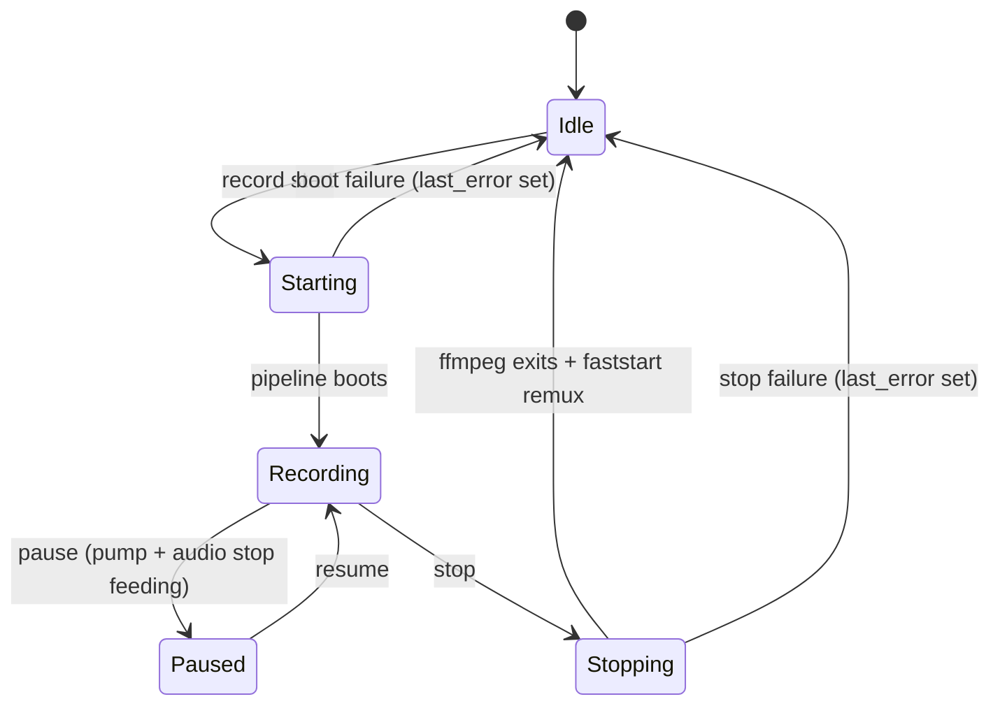
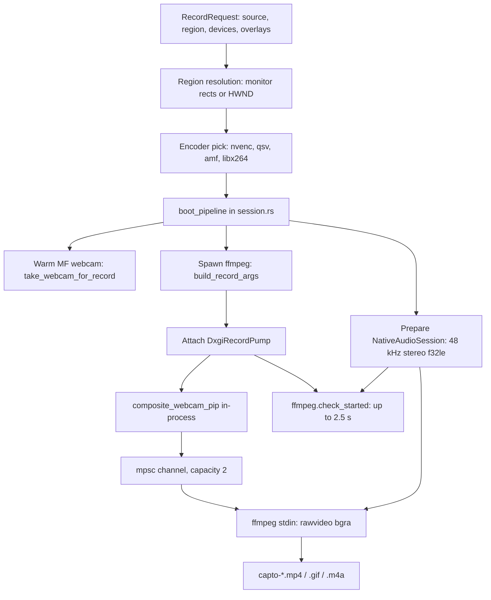

# Recording

Active contributors: elwina

## Purpose

Recording is Capto's end-to-end capture capability: turning a display, window, or region of the Windows desktop, plus optional microphone and system audio, into a local MP4, GIF, or m4a file. It is what a user starts from the UI buttons, the tray, or the hotkeys, and what an agent drives through the `capto` CLI. Everything funnels into one `RecordingSession` owned by the desktop app, so the mouse, the hotkeys, and the CLI never drive the recorder differently (see [Desktop app](../apps/desktop/index.md) and [CLI](../apps/cli.md)).

What a user or agent experiences:

```bash
capto record start --source display --display 0 --format mp4 --fps 30
capto status          # poll until "recording"
capto record stop
capto outputs recent --limit 1
```

In the UI the same flow is the record button in the main window, the tray `start`/`pause`/`stop` items, and the `Alt+F5..F8` hotkey cluster. Each of those enters the same service layer, `apps/desktop/src-tauri/src/session_svc.rs`, which builds a `RecordRequest` and hands it to `RecordingSession::start` in `crates/capto-core/src/session.rs`.

## How it works

### Session states

The recording lifecycle is a five-state machine in `crates/capto-core/src/session.rs`:



State is derived, not stored. `snapshot()` reports `Idle` when nothing is live and decides between `Recording` and `Paused` from whether a pause is in progress. Each transition emits a `session://state` event carrying the `SessionSnapshot` (`{ state, elapsedMs, outputPath, lastError, encoder, hideApp }`), which both the React UI and the CLI consume. Failure always funnels into `lastError`, and a successful start clears it.

### Start pipeline

`RecordingSession::start` in `crates/capto-core/src/session.rs` runs this sequence:

1. Guard: reject with an "already recording" error if a session is live.
2. Resolve the capture geometry into a physical screen rectangle. Window capture resolves the HWND via `capto_capture::window_by_id`; display capture prefers physical monitor rects from `capto_capture::list_monitor_rects` (xcap DIP sizes disagree under mixed DPI), with a fallback through `normalize_display_rect` that maps the xcap rect onto the nearest monitor. The rectangle is clamped to the virtual screen and rejected if it lies outside it.
3. Pick the encoder. GIF output always uses the GIF encoder; otherwise the order is `RecordRequest.encoder`, then `settings.preferred_encoder`, then `FfmpegEncoder::pick_best_h264`, which probes the sidecar and returns the first available of `h264_nvenc`, `h264_qsv`, `h264_amf`, `libx264` (see `crates/capto-encode/src/lib.rs`).
4. Boot the pipeline. `boot_pipeline` prepares the WASAPI audio session first (unless GIF), then warms the webcam before FFmpeg starts, because reopening Media Foundation after preview can take seconds and would leave a blank PiP intro. It then builds the FFmpeg argv with `build_record_args`, spawns the sidecar, attaches a `DxgiRecordPump` that pushes rawvideo frames on a Tokio channel to FFmpeg stdin, starts audio, and runs `ffmpeg.check_started`, which polls for up to about 2.5 seconds (25 sleeps of 100 ms) to catch immediate encoder or device failures.
5. Fall back only when needed: if boot fails for MP4 with any non-libx264 encoder, the pipeline retries once with libx264; if the retry fails too, `lastError` is set and the failure surfaces.

The producers start before the health check, so the elapsed clock in the UI matches the encode timeline rather than the moment `start` returns.



### Frame pump pacing

`DxgiRecordPump::start` in `crates/capto-capture/src/record_dxgi.rs` spawns a dedicated "capto-dxgi-record" thread that reads DXGI Desktop Duplication frames, scales them to the even output size, composites the webcam PiP in-process when enabled (`composite_webcam_pip` in `crates/capto-capture/src/composite.rs`), and pushes BGRA frames into the channel. Pacing is deadline-based: the pump sleeps until the next frame deadline and snaps the deadline forward when it falls more than one frame interval behind, so a slow encoder never triggers a catch-up burst that reads as stutter. A separate writer task drains the channel into FFmpeg stdin with `write_all` and logs `slow_writes` when a single write blocks at least 250 ms, which marks capture outrunning the encoder (see `docs/profiling.md`).

### Pause and resume

`pause` in `crates/capto-core/src/session.rs` stops the producers, not FFmpeg: it calls `DxgiRecordPump::set_paused(true)` and `NativeAudioSession::set_paused(true)` and stamps `pause_started`. With no frames and no PCM flowing, the encode timeline simply skips paused wall time and no gap opens up. `resume` accumulates the pause into `paused_accum_ms` and un-pauses both producers. `snapshot` computes `elapsedMs` as wall time since the encode started, minus accumulated pauses, minus the current pause, so the elapsed number the user sees equals the output duration rather than the wall clock. Pause only works from `Recording` and resume only from `Paused`; both reject with an invalid-state error otherwise, and pause cannot start from `Idle` because there is no live recording to pause.

### Stop, remux, and failure diagnostics

`stop` tears down in dependency order: it stops the video pump, drops the webcam so the preview can reopen the MF device, stops audio, waits 150 ms so the stdin writer observes the channel close and delivers EOF to FFmpeg, then drops any remaining child stdin and waits for FFmpeg with a 12-second timeout, killing it if it does not exit. For MP4 output the file is remuxed: `remux_frag_to_faststart` renames the fragmented file aside and runs `ffmpeg -c copy -movflags +faststart` through `FfmpegEncoder::run_once`, restoring the fragmented file if the remux fails, so common players (Movies & TV, QuickTime) open the result reliably. Finally the output must exist and be larger than 1024 bytes; otherwise the last six non-empty lines of the rolling FFmpeg stderr tail are joined into `lastError` so a dead recording is explainable rather than silent.

## Formats and options

| Format | Extension | Notes |
|--------|-----------|-------|
| MP4 | `.mp4` | Video is written fragmented (`+frag_keyframe+empty_moov+default_base_moof`) so a killed FFmpeg still leaves a playable file, then remuxed to faststart after a clean stop. Audio is AAC at 192 kbps. |
| GIF | `.gif` | `palettegen`/`paletteuse` graph, fps capped at 15, no audio track. |
| Audio only | `.m4a` | Video disabled (`-vn`); only the mic and loopback PCM inputs are encoded. |

A recording is defined by `RecordRequest` and rendered into FFmpeg argv by `build_record_args` in `crates/capto-core/src/ffmpeg_args.rs`:

- Quality is `1..=100` and maps to CRF through `quality_to_crf` (51 minus a linear term, clamped to 18..51); higher is better and larger.
- `include_cursor` draws the system cursor into the captured frames.
- `mic_device`, `loopback_device`, and per-device volumes (up to 200%) control the WASAPI inputs; when both devices are present an `amix` graph with `normalize=0` mixes them. PCM inputs use `-analyzeduration 0` and `-probesize 32` so FFmpeg does not probe the live TCP inputs and offset their clocks.
- `fps` paces the DXGI pump (clamped to 1..120).
- `hide_app_while_recording` hides the main window after start so the app never appears in the frames; in the preview stage, `capture_preview` separately blackouts the app's rectangle so the UI can show the masked area.
- Output files land in `settings.output_dir` (default `Videos\Capto`) named `capto-YYYYMMDD-HHMMSS-<8hex>.mp4|gif|m4a`: a local timestamp plus the first eight characters of a v4 UUID, generated by `RecordingSession::make_output_path`. The folder is created on demand.

## Integration points

- The desktop shell is the single owner of the `RecordingSession`; `apps/desktop/src-tauri/src/session_svc.rs` is the only caller of `start`/`pause`/`resume`/`stop`, shared by Tauri commands, tray items, hotkeys, and the `/v1/record/*` control-plane routes. It stops any running audio meter on start, hides the main window when requested, starts the record overlay, and emits `session://state`.
- The `capto` CLI never creates a second session; it drives the desktop over localhost HTTP (see [CLI](../apps/cli.md) and [Control-plane API](../api/index.md)).
- Capture, audio, and encoding live in their own crates: [capto-capture](../crates/capto-capture.md), [capto-audio](../crates/capto-audio.md), and [capto-encode](../crates/capto-encode.md). Session mechanics are documented in [capto-core](../crates/capto-core.md), and the audio and webcam PiP user stories are in [Audio capture](audio-capture.md) and [Webcam PiP](webcam-pip.md).

## Entry points for modification

- Session flow, state machine, boot order, pause accounting, stop sequence, and faststart remux: `crates/capto-core/src/session.rs`.
- FFmpeg argv, quality-to-CRF mapping, audio mixing graph, GIF graph, and frame sizing: `crates/capto-core/src/ffmpeg_args.rs`.
- How starts, pauses, stops, and outputs are exposed to the UI, tray, hotkeys, and control plane: `apps/desktop/src-tauri/src/session_svc.rs`.
- Capture pacing and cursor drawing: `crates/capto-capture/src/record_dxgi.rs`.

## Key source files

| File | Role |
|------|------|
| `crates/capto-core/src/session.rs` | `RecordingSession`, state machine, boot and teardown, pause math, output naming, faststart remux |
| `crates/capto-core/src/ffmpeg_args.rs` | `RecordRequest`, `Region`, `build_record_args`, `quality_to_crf`, frame sizing |
| `crates/capto-core/src/settings.rs` | Defaults that fill the request: fps, quality, devices, output dir, encoder preference |
| `crates/capto-capture/src/record_dxgi.rs` | `DxgiRecordPump` frame source, pacing, pause flag |
| `crates/capto-encode/src/lib.rs` | FFmpeg sidecar spawn, `pick_best_h264`, `check_started`, `run_once` |
| `apps/desktop/src-tauri/src/session_svc.rs` | Shared service layer behind UI, tray, hotkeys, and CLI |
