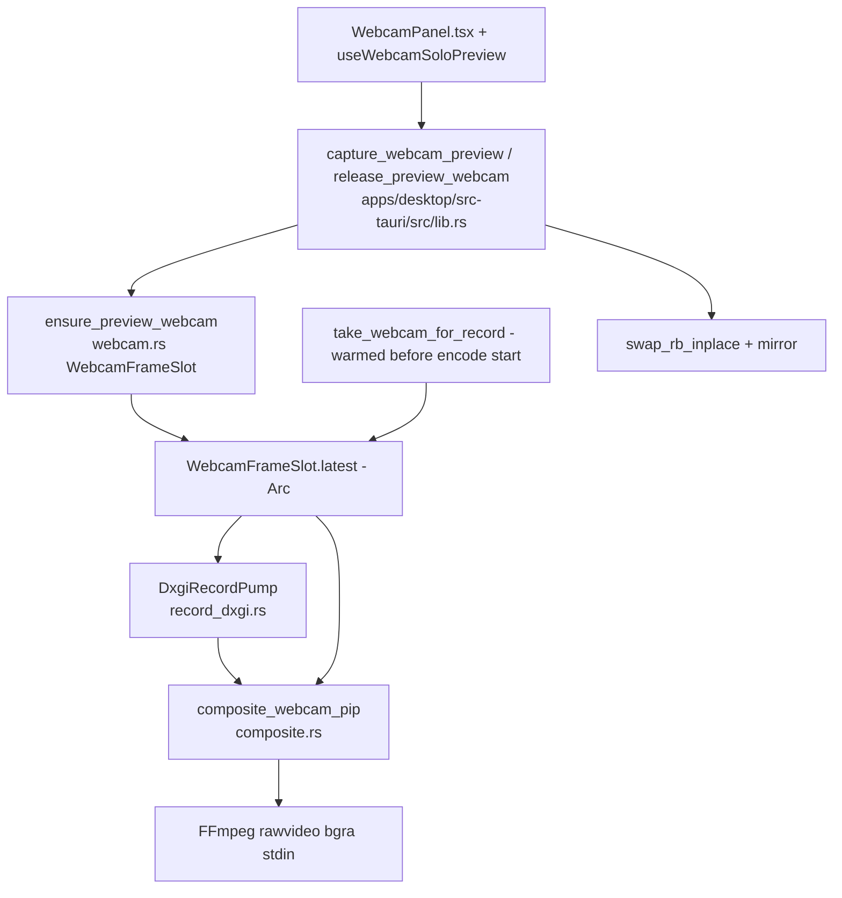

# Webcam PiP

Active contributors: elwina

## Purpose

Capto can overlay your webcam as a picture-in-picture (PiP) box on recordings, with your choice of size, position, corner radius, and mirroring. The camera is captured natively with Media Foundation (not `getUserMedia`, not FFmpeg `dshow`) and composited into every record frame in-process before the encoder sees it, so the PiP is present from frame 0 and FFmpeg never opens the camera as an input.

The capture side lives in `crates/capto-capture/src/webcam.rs`, the PiP blit in `crates/capto-capture/src/composite.rs` using the `WebcamPip` layout from `crates/capto-overlay/src/lib.rs`, and the UI in `apps/desktop/src/components/WebcamPanel.tsx` plus the preview hooks in `apps/desktop/src/hooks/`.

## How it works

The `WebcamFrameSlot` (`crates/capto-capture/src/webcam.rs`) is a shared `Arc<Mutex<Option<Arc<Frame>>>>`. The "capto-webcam" MF reader thread is the only writer; preview and the record pump both read it by cloning the `Arc`, so no pixels are copied on read.

### Media Foundation capture

`WebcamCapture::start` (in `crates/capto-capture/src/webcam.rs`) spawns the "capto-webcam" thread and uses an `IMFSourceReader` to pull frames. It scores native media types by format bias (YUY2/NV12/RGB32), size match, and frame rate (30 FPS is the PiP sweet spot), then falls back to asking MF to deliver RGB32 (which may decode MJPG). Frames are converted to BGRA and scaled to the PiP slot size in Rust (`yuy2_to_bgra`, `nv12_to_bgra`, `read_rgb32`). The thread does not sleep on stream ticks, so internal consumer cameras throttle naturally. `start` announces readiness only after the first real frame lands in the slot (8-second timeout), so a recording never begins with a blank PiP and the caller gets an error instead of a black box.

### Preview slots vs record warming

Two entry points share the one process-wide camera:

- `ensure_preview_webcam` manages the preview camera (the `PREVIEW_CAM` global). It reuses the running capture when the requested device matches and otherwise swaps in a fresh one, returning the slot the UI reads for the preview tab. `capture_webcam_preview` (`apps/desktop/src-tauri/src/lib.rs`) reads `slot.latest()`, swaps channels with `swap_rb_inplace` from `crates/capto-capture/src/composite.rs` (MF stores BGRA; the JPEG encoder wants RGBA), mirrors if configured, and encodes with `preview_jpeg(480, 72)`.
- `take_webcam_for_record` warms the camera before the encode clock starts so PiP frames exist from frame 0. It prefers reusing the live preview capture (same device with at least one frame in the slot) to avoid a long MF reopen gap at the file start; otherwise it sleeps 400 ms for the old MF graph to release the device exclusively, opens a fresh capture, and fails if no frames arrive.

### In-process compositing

`composite_webcam_pip` (`crates/capto-capture/src/composite.rs`) blits the camera frame over the record frame per the `WebcamPip` layout. It clamps the PiP box to the base frame, resolves the top-left with `resolve_pixel_position` from `crates/capto-overlay/src/lib.rs`, and applies the corner radius (capped at half the box) and mirroring. A straight row-copy fast path skips per-pixel work when the camera already matches the PiP box size, has no rounded corners, and lands fully inside the frame. `swap_rb_inplace` flips R/B for the preview JPEG path.

### Device matching and soft-failure

Devices are matched by MF symbolic-link id or friendly label. `capture_webcam_preview` prefers the requested `device_id`, then the persisted `webcam.deviceId`, then `webcam.deviceLabel`; `take_webcam_for_record` matches by id containment as well. If the camera cannot be opened (busy, denied, no device, unsupported), capture fails and the recording continues screen-only: the PiP is simply skipped (`composite_webcam_pip` returns early when `!pip.enabled` or the camera frame is missing), and errors surface in the UI via `webcamErrorText` in `apps/desktop/src/components/WebcamPanel.tsx`.

## Configuration options

The `WebcamPip` struct in `crates/capto-overlay/src/lib.rs`, edited from `apps/desktop/src/components/WebcamPanel.tsx`:

| Field | Default | Meaning |
|-------|---------|---------|
| `enabled` | false | Turn the PiP on |
| `deviceId` / `deviceLabel` | None | MF symbolic link or friendly name matched for open |
| `position.anchor` | bottomRight | PiP anchor |
| `position.x` / `position.y` | 0.82 / 0.78 | Normalized fine-tune per anchor |
| `width` / `height` | 320 / 240 | PiP box size |
| `mirrored` | true | Mirror the camera image |
| `corner_radius` | 12 | Rounded-corner radius in pixels |

## Preview while recording

The Webcam settings tab live-previews the camera through `useWebcamSoloPreview` (`apps/desktop/src/hooks/useWebcamSoloPreview.ts`), which polls `capture_webcam_preview` on a ~66 ms interval and renders the returned JPEG. Previewing is paused while recording: `capture_webcam_preview` returns an error when the session is not `Idle`, and `WebcamPanel` passes `previewCam = false` during a take so the MF camera stays free for the record pump. `useWebcamPreview` (`apps/desktop/src/hooks/useWebcamPreview.ts`) only enumerates devices from the `list_webcams` command; live camera motion is composited into the main DXGI preview, not streamed as a separate feed.

## Integration points

- `crates/capto-core/src/session.rs` `boot_pipeline` warms the webcam with `take_webcam_for_record` before starting the encode clock and keeps the `WebcamCapture` alive (`_webcam`) inside `LiveRecording`.
- `crates/capto-capture/src/record_dxgi.rs` `RecordPip` holds the `WebcamFrameSlot` plus `WebcamPip` so the pump composites in-process before frames reach the encoder.
- `apps/desktop/src-tauri/src/lib.rs` exposes `list_webcams`, `capture_webcam_preview`, and `release_preview_webcam`, and mirrors the PiP (`mirror_rgba_inplace`) for preview.
- The `WebcamPip` layout shared with the preview drag UI is documented in [capto-overlay](../crates/capto-overlay.md) and [capto-capture](../crates/capto-capture.md); the recording pipeline it feeds is in [recording](../features/recording.md).

## Entry points for modification

- Change PiP placement or mirror/blend: `composite_webcam_pip`, `inside_rounded`, and `swap_rb_inplace` in `crates/capto-capture/src/composite.rs`.
- Tune camera opening: media-type scoring, frame-rate bias, and timeouts in `crates/capto-capture/src/webcam.rs`, plus `take_webcam_for_record` reuse behavior.
- Change the layout defaults or anchors: `WebcamPip` and `resolve_pixel_position` in `crates/capto-overlay/src/lib.rs`.
- Change the UI tab: `apps/desktop/src/components/WebcamPanel.tsx` and `apps/desktop/src/components/PreviewStage.tsx` (the on-canvas placement guide), plus `apps/desktop/src/hooks/useWebcamSoloPreview.ts` polling.

## Key source files

| File | What to look for |
|------|------------------|
| `crates/capto-capture/src/webcam.rs` | `WebcamCapture`, `WebcamFrameSlot`, `ensure_preview_webcam`, `take_webcam_for_record`, `list_webcams` |
| `crates/capto-capture/src/composite.rs` | `composite_webcam_pip`, `inside_rounded`, `swap_rb_inplace` |
| `crates/capto-capture/src/record_dxgi.rs` | `RecordPip` PiP metadata in the record pump |
| `crates/capto-overlay/src/lib.rs` | `WebcamPip`, `resolve_pixel_position`, anchors |
| `crates/capto-core/src/session.rs` | `boot_pipeline` webcam warming, `_webcam` in `LiveRecording` |
| `apps/desktop/src-tauri/src/lib.rs` | `list_webcams`, `capture_webcam_preview`, `release_preview_webcam`, mirroring |
| `apps/desktop/src/components/WebcamPanel.tsx` | Webcam settings tab, error mapping, preview + placement |
| `apps/desktop/src/components/PreviewStage.tsx` | PiP placement guide on the recording stage |
| `apps/desktop/src/hooks/useWebcamSoloPreview.ts` | Polls `capture_webcam_preview` for the tab preview |
| `apps/desktop/src/hooks/useWebcamPreview.ts` | Device enumeration via `list_webcams` |
