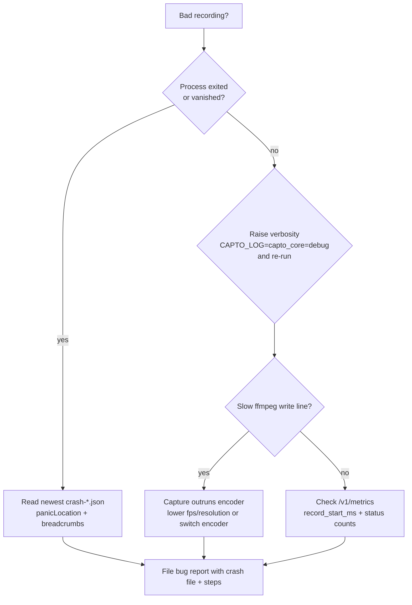

# How to monitor

Capto is a local-first desktop app, and its monitoring story is deliberately the same shape as its privacy story: everything lives on the machine, nothing is sent elsewhere. There is no remote telemetry endpoint to query and no SaaS dashboard to open. "Monitoring" here means reading the local signals Capto leaves behind, text logs, a loopback metrics endpoint, and crash reports, and correlating them with the `x-request-id` that ties an individual request to a log line and a crash trail.

This page sets out what observability exists, what intentionally does not, and how to get useful signal when a recording comes out wrong. The details live on the pages linked below.

## What exists

| Signal | Where it lives | How to read it | Page |
|--------|----------------|----------------|------|
| Text logs | `tracing` output to the process stderr/stdout | Watch the desktop or CLI process output; set `CAPTO_LOG` / `RUST_LOG` to raise verbosity | [Logging](logging.md) |
| Local metrics | In-process `Metrics` registry served at `GET /v1/metrics` | `curl` the endpoint with the Bearer token from `cli-server.json` | [Metrics](metrics.md) |
| Crash reports | `crash-*.json` written by the panic hook | Open the newest file and read the panic site and breadcrumb trail | [Crashes](crashes.md) |
| Request correlation | `x-request-id` header on every control-plane call | Match the id across telemetry log lines and crash breadcrumbs | Logging, [Crashes](crashes.md) |

## What intentionally does not exist

- **No remote telemetry.** There is no Sentry, Mixpanel, Amplitude, PostHog, or GA4 in the dependency tree, and no off-box event. See [Privacy and security](../security.md).
- **No dashboards.** `/v1/metrics` returns JSON; there is no UI, no aggregation service, and no historical store. Counters are per-process and reset on launch.
- **No runtime alerting.** A hung or misbehaving recording will not page anyone. The only alerting that exists is build health in CI, which files GitHub issues through `.github/workflows/ci-alert.yml` (see [Deployment](../deployment.md)).

## Getting signal on a bad recording

When a recording is broken or produces a bad file, the useful questions are "did capture outrun the encoder?" and "did the process crash today?". The fastest path is to reproduce, watch the logs, and check the crash folder afterward.

1. **Reproduce** the failing action while watching the desktop process output. The desktop owns the frame pump and encoder, so its stderr is where the diagnostics appear; raise verbosity with `CAPTO_LOG=capto_core=debug` to see the slow-write lines. See [Logging](logging.md).
2. **Look for the `slow ffmpeg write` line.** If it appears and the output froze or dropped frames, capture is producing frames faster than the encoder can drain them, drop capture fps/resolution or switch encoder. See [Metrics](metrics.md) for the duration counters that back this up.
3. **Check for a crash report** under the crash folder if the app vanished or ended mid-recording. The newest `crash-*.json` gives an exact `panicLocation` and the breadcrumb trail that led to it. See [Crashes](crashes.md).
4. **Read `/v1/metrics`** for the session aggregate: `record_start_ms`, `http_request_duration_ms`, and per-status counts tell you whether a slow call was the CLI control plane or the encode path. See [Metrics](metrics.md).

## When to file a bug report

A good report includes the version, the crash file (if one was written), the exact breadcrumb sequence or log tail, and the reproduction steps. The [Crashes](crashes.md) page walks through collecting all of these. Because Capto is deliberate about never shipping PII or credentials out, make sure any pasted logs and crash content are scrubbed, the codebase points at `crates/capto-ipc/src/redact.rs` and `docs/PII.md` for the rules your pasted output should follow too.

## Related

- [Logging](logging.md), where logs go, filter strings, how to add a log line
- [Metrics](metrics.md), what counts, how to read `/v1/metrics`, how to add a counter
- [Crashes](crashes.md), the panic hook, breadcrumbs, and crash-report collection
- [Endpoints](../api/endpoints.md), the `GET /v1/metrics` contract and its auth
- [Privacy and security](../security.md), why monitoring is local-first and scrubbed
- [Updates](../features/updates.md), crash reporting in the canary validation loop
- [Glossary](../overview/glossary.md), breadcrumbs, redaction, and the control plane
- [Deployment](../deployment.md), the only alerting that exists (CI build-health)
