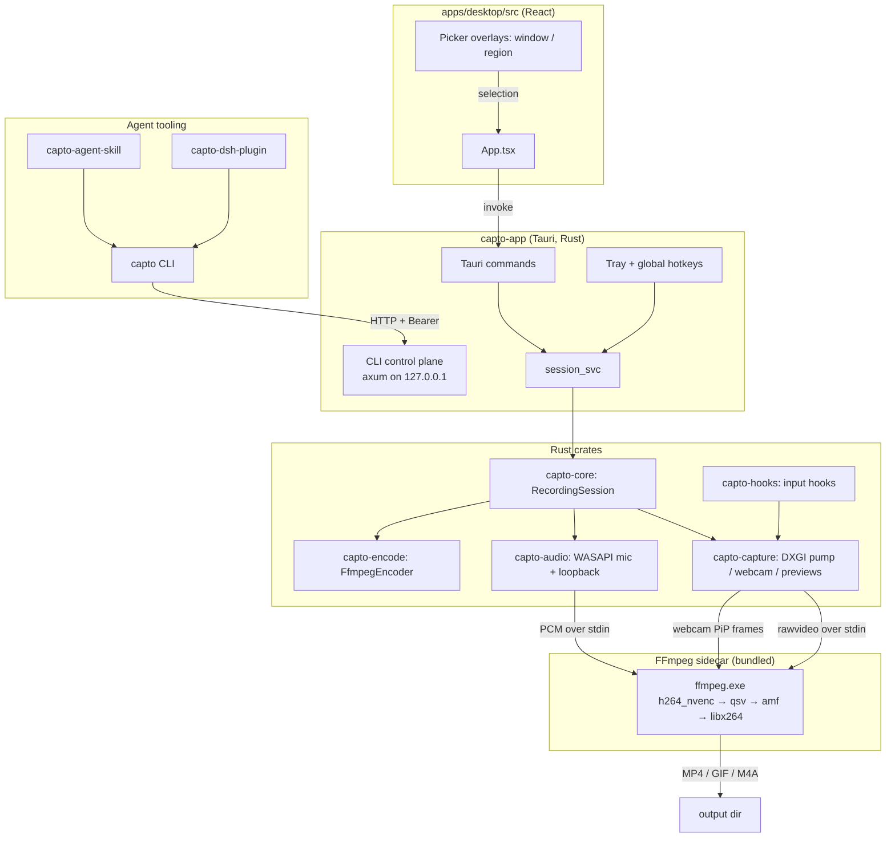
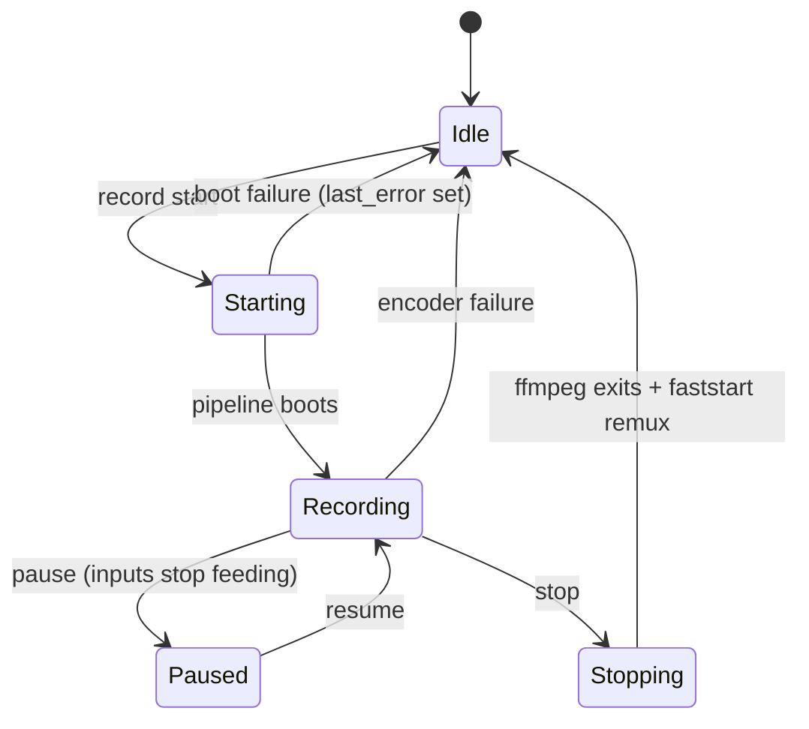

# Architecture

Capto splits into four layers: the React UI (intents only), the Tauri desktop shell (session ownership + control plane), the Rust recording crates (capture, audio, encode), and the FFmpeg sidecar (encoding). The `capto` CLI is a thin agent-facing client of the desktop control plane.

## Recording pipeline

The pipeline is the heart of the app and lives in `crates/capto-core/src/session.rs`:

1. `RecordingSession::start` resolves the capture region (physical monitor rects via `capto_capture::list_monitor_rects`, HWND rects for window capture), picks an encoder (explicit choice → `settings.preferred_encoder` → `FfmpegEncoder::pick_best_h264`, which is NVENC → QSV → AMF → libx264), and boots the pipeline.
2. `boot_pipeline` warms the webcam first (Media Foundation) so PiP frames exist from frame 0, spawns FFmpeg, then attaches a `DxgiRecordPump` (`crates/capto-capture/src/record_dxgi.rs`) that feeds rawvideo frames to FFmpeg's stdin on a Tokio channel. Audio, when enabled, runs as a `NativeAudioSession` (`crates/capto-audio/src/windows.rs`) streaming 48 kHz stereo `f32le` PCM to FFmpeg over its stdin as well.
3. Webcam PiP is composited in-process by `capto_capture::composite_webcam_pip` before frames reach FFmpeg; the elapsed timer is UI-only and never burned in.
4. On `stop`, the pump and audio sources close, FFmpeg receives stdin EOF, and `remux_frag_to_faststart` rewrites the fragmented MP4 into a progressive file with `+faststart` so common players open it reliably. Encoder failures during boot fall back to libx264 for MP4.

## Session state machine

`RecordingSession` transitions between five states, defined in `crates/capto-core/src/session.rs`:

Errors funnel into `last_error`, which surfaces in `SessionSnapshot` and to the UI and control plane. `SessionSnapshot` (`{ state, elapsedMs, outputPath, lastError, encoder, hideApp }`) is the single status type emitted to React, the CLI, and the control plane.

## Single instance and the control plane

The desktop is single-process (`tauri-plugin-single-instance` registered first in `apps/desktop/src-tauri/src/lib.rs`), so there is exactly one `RecordingSession` per machine. At startup it binds an axum server on `127.0.0.1:<ephemeral>` and writes `{config_dir}/Capto/cli-server.json` with `pid`, `port`, `token`, and `version` (`crates/capto-ipc/src/lockfile.rs`). The CLI reads that file, authenticates with `Authorization: Bearer <token>`, and calls `/v1/*` endpoints. If the plane is down, the CLI auto-launches the desktop (unless `--no-launch`); the single-instance guarantee means that spawn cannot create a second recorder. Shared request/response types live in `crates/capto-ipc/src/types.rs`; the full endpoint map is in [Control-plane API](../api/index.md).

## UI contract

React never processes frames. It invokes intent commands (`start_recording`, `pause_recording`, `save_settings`, `take_screenshot`, `capture_preview`, …) declared in `apps/desktop/src-tauri/src/lib.rs`, and renders state from `session://state` events and `get_session_state`. Low-resolution JPEG preview frames are produced natively (`Frame::preview_jpeg` in `crates/capto-capture/src/lib.rs`) so the browser only ever handles compressed stills.

## Language and size profile

Rust carries the pipeline (~43 source files across `crates/` plus the Tauri shell); the React frontend is a single-page app (~22 TS/TSX files) with 10 i18n locales under `apps/desktop/src/i18n/locales`. The static landing page (`website/`) and the Cloudflare updater mirror worker (`cloudflare/worker.js`) are intentionally small, separate deployables.
