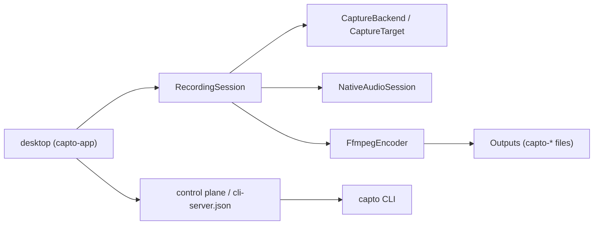

# Data models

The core serializable types of Capto are plain Rust structs and enums using serde with `rename_all = "camelCase"`. They are shared between the UI, the CLI, and the control plane, so the camelCase JSON shape is the contract that crosses process boundaries. This page lists the main types and their fields; see [Configuration](configuration.md) for `AppSettings` defaults and the settings file.

## Relationship overview

## Session

`crates/capto-core/src/session.rs`.

| Type | Fields |
|------|--------|
| `SessionState` (enum) | `Idle`, `Starting`, `Recording`, `Paused`, `Stopping` |
| `SessionSnapshot` | `state`, `elapsedMs` (u64), `outputPath` (string \| null), `lastError` (string \| null), `encoder` (string \| null), `hideApp` (bool) |

`RecordingSession` is the machine-wide session owner (settings, capture backend, discovered encoder, live recording behind a `tokio::sync::Mutex`). It exposes `start`, `pause`, `resume`, `stop`, `snapshot`, `take_screenshot`, `make_output_path`, `audio_levels`. See [capto-core](../crates/capto-core.md).

### Output naming

`RecordingSession::make_output_path` produces:

- `capto-YYYYMMDD-HHMMSS-<8hex>.mp4|gif|m4a` (local timestamp plus the first 8 chars of a v4 UUID)
- `capto-shot-YYYYMMDD-HHMMSS-<8hex>.png` from `default_screenshot_path`

Extensions map by `OutputFormat`: `mp4`, `gif`, `m4a` (audio-only).

## Settings

`crates/capto-core/src/settings.rs`. `AppSettings` is summarized in [Configuration](configuration.md); key shared enums are `OutputFormat` (`mp4` / `gif` / `audioOnly`) and `VideoSourceKind` (`display` / `window` / `region`), both re-exported to `crates/capto-ipc/`.

## Overlays

`crates/capto-overlay/src/lib.rs`. A positioning type, the individual overlay models, and the aggregate config embedded in both `AppSettings.overlays` and `RecordRequest.overlays`.

| Type | Fields |
|------|--------|
| `OverlayAnchor` (enum) | `TopLeft`, `TopRight`, `BottomLeft`, `BottomRight`, `Center`, `Custom` |
| `OverlayPosition` | `anchor`, `x` (f32, normalized 0..1), `y` (f32). Default `bottomRight` at `(0.85, 0.85)`. |
| `TextOverlay` | `id`, `text`, `fontSize`, `color`, `position`, `enabled` |
| `ImageOverlay` | `id`, `path`, `width`, `height`, `position`, `opacity` (f32), `enabled` |
| `MouseClickOverlay` | `enabled`, `leftColor`, `rightColor`, `middleColor`, `radius` |
| `KeystrokeOverlay` | `enabled`, `position`, `fontSize`, `color`, `background` |
| `ElapsedOverlay` | `enabled`, `position`, `fontSize`, `color`. Deprecated; kept for settings JSON compatibility, not burned into recordings. |
| `WebcamPip` | `enabled`, `deviceId` (string \| null), `deviceLabel` (string \| null), `position`, `width`, `height`, `mirrored`, `cornerRadius` |
| `OverlayConfig` | `mouseClicks`, `keystrokes`, `elapsed` (deprecated), `texts` (array), `images` (array), `webcam` |

Also exported: `resolve_pixel_position` (anchor/normalized position to pixel placement) and `escape_filter_path` (escape a filesystem path for an FFmpeg filtergraph option). See [capto-overlay](../crates/capto-overlay.md).

## Capture

`crates/capto-capture/src/lib.rs` plus `CaptureBackend` in `crates/capto-capture/src/backend.rs`.

| Type | Fields / variants |
|------|-------------------|
| `CaptureTarget` (enum, tagged by `kind`) | `Display { id }`, `Window { id }`, `Region { x, y, width, height }` |
| `DisplayInfo` | `id`, `name`, `width`, `height`, `x`, `y`, `isPrimary`, `scaleFactor` |
| `WindowInfo` | `id`, `title`, `appName`, `width`, `height`, `x`, `y` |
| `Frame` | `width`, `height`, `rgba` (Vec<u8>), `timestampMs` (u64). Not serde. |

`Frame` provides `blackout_rect`, `preview_jpeg`, and `save_png`. `CaptureBackend` is the trait new backends implement (`list_displays`, `list_windows`, `capture_frame`, `platform_name`); Windows uses WGC/DXGI-oriented implementations, macOS/Linux ship stubs. See [capto-capture](../crates/capto-capture.md).

## Recording request

`crates/capto-core/src/ffmpeg_args.rs`.

| Type | Fields |
|------|--------|
| `Region` | `x`, `y`, `width`, `height` |
| `RecordRequest` | `source`, `displayId`, `windowId`, `region`, `includeCursor`, `micDevice`, `loopbackDevice`, `micVolume` (default 100), `loopbackVolume` (default 100), `encoder`, `format`, `fps`, `quality` (default 60), `outputPath`, `overlays`, `hideAppWhileRecording` |

`RecordRequest::from_settings(settings, output_path)` builds a default request from `AppSettings`. This is the intent payload one recording is made from.

## IPC wire types

`crates/capto-ipc/src/types.rs`, `envelope.rs`, and `lockfile.rs`. These describe the local control-plane HTTP contract; see [capto-ipc](../crates/capto-ipc.md).

| Type | Fields |
|------|--------|
| `RecordStartRequest` | `source`, `displayId`, `windowId`, `region`, `includeCursor`, `micDevice`, `loopbackDevice`, `micVolume`, `loopbackVolume`, `encoder`, `format`, `fps`, `quality` (all optional; zeros/defaults from the desktop) |
| `ShotRequest` | `source`, `displayId`, `windowId`, `region` |
| `OutputEntry` | `path`, `name`, `bytes`, `modifiedMs` |
| `OutputsList` | `outputDir`, `items` (Vec<OutputEntry>) |
| `OpenOutputsRequest` | `path` (string \| null), `folder` (bool), `last` (bool) |
| `DoctorInfo` | `os`, `captureBackend`, `ffmpegPath`, `ffmpegOk`, `controlPlane`, `pid`, `port`, `preferredEncoder` |
| `ConfigPathInfo` | `path` |
| `ServerLock` | `pid`, `port`, `token`, `version` |
| `ApiError` | `code`, `message` |
| `Envelope<T>` | `ok` (bool), `data` (T \| null), `error` (`ApiError` \| null) |
| `ExitCode` (enum) | `Ok`=0, `Usage`=1, `DesktopUnavailable`=2, `StateConflict`=3, `Capture`=4, `Encode`=5, `ConfigIo`=6 |

`ServerLock` is written to `cli-server.json` in the config dir by the desktop control plane; the CLI reads it to discover the port and bearer token. `Envelope` is the CLI stdout contract and the HTTP response wrapper; `ExitCode` values map to the process exit status of `capto`.

## Crash report

`apps/desktop/src-tauri/src/crashlog.rs`. When the desktop panics and the `crash-reporting` flag is enabled, a report named `crash-<ms>.json` is written to `<config>/Capto/crashes/`.

| Field | Type | Meaning |
|-------|------|---------|
| `app` | string | Always `Capto`. |
| `version` | string | `CARGO_PKG_VERSION`. |
| `os` | string | Platform, for example `windows`. |
| `timestampMs` | u64 | Time of the panic. |
| `subject` | string | Panic message. |
| `backtrace` | string | Full captured stack. |
| `panicLocation` | string \| null | Exact `file:line:col` when available. |
| `pid` | u32 | Process id. |
| `uptimeMs` | u64 | Milliseconds since process start. |
| `featureFlags` | string array | Feature flags active at crash time. |
| `lastRequestId` | string \| null | Most recent control-plane request id for log correlation. |
| `breadcrumbs` | array | Trail of recent lifecycle/session/control-plane/hotkey events (each with `category`, `message`, `requestId`, `relMs`, `atMs`). |

Writing is best-effort and never blocks the panic handler; nothing is uploaded. The breadcrumb trail is capped and scrubbed by construction.
